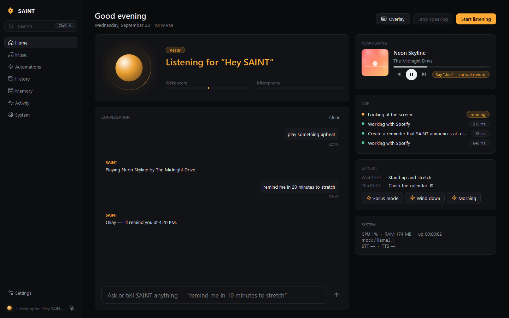
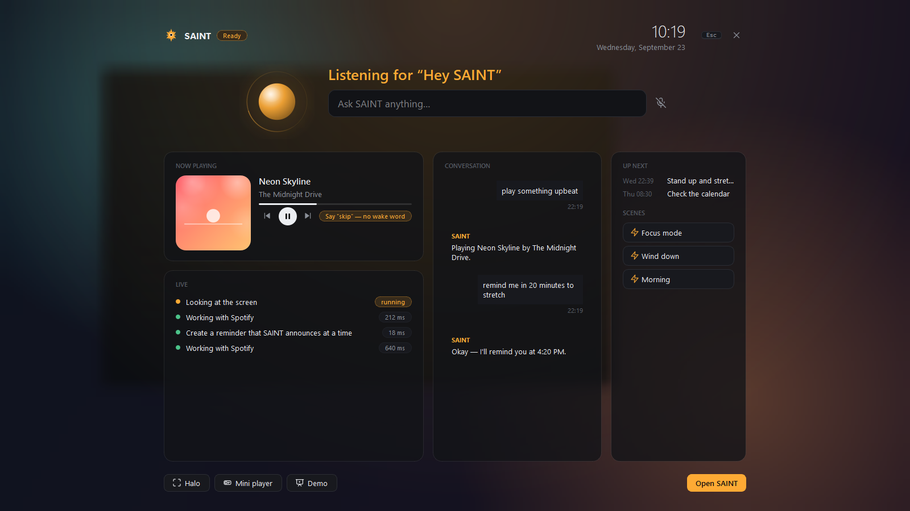
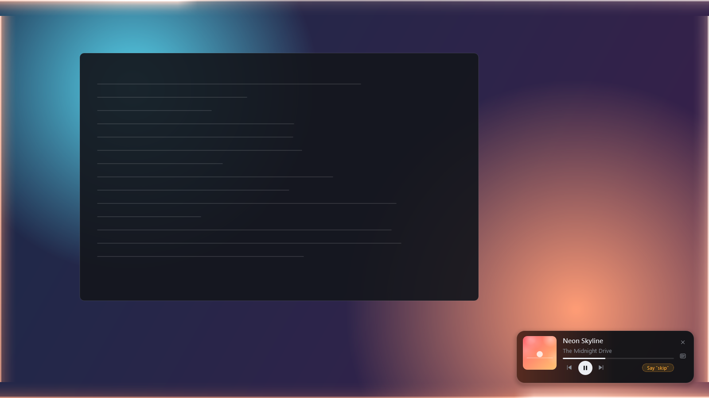
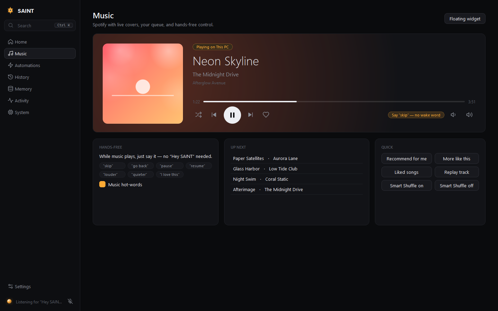
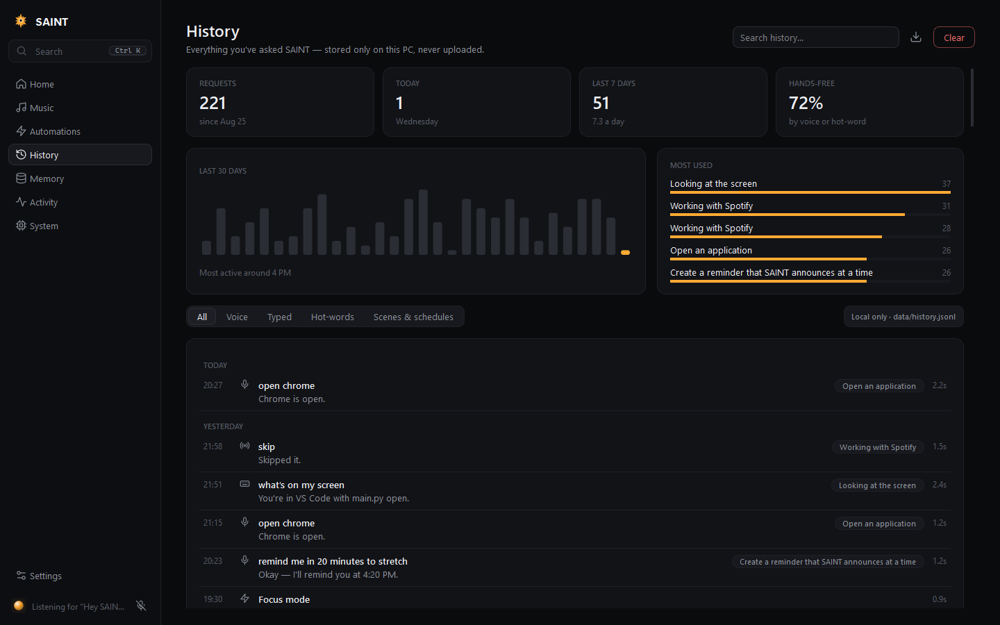
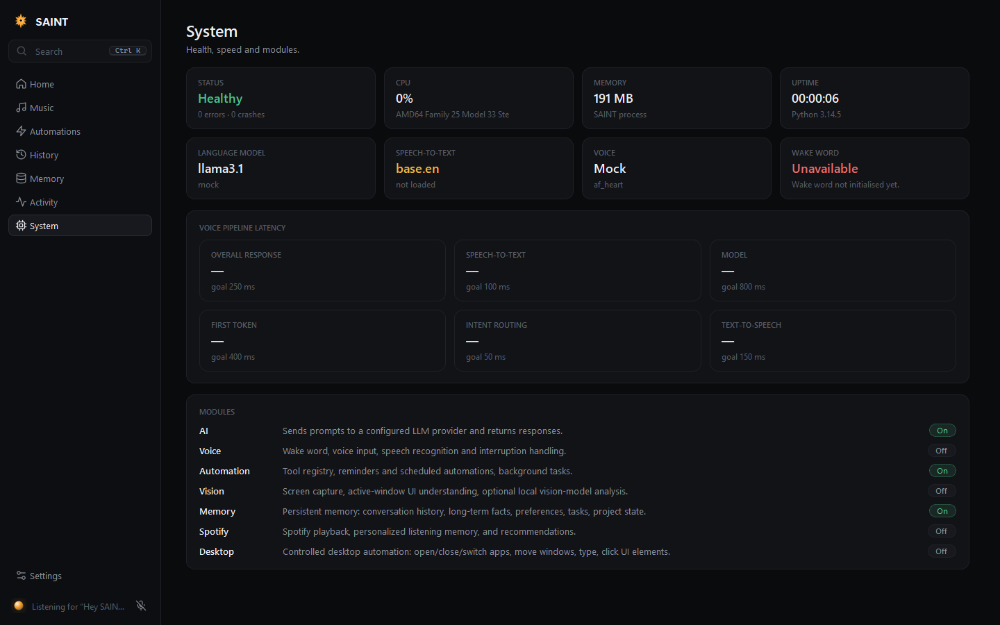
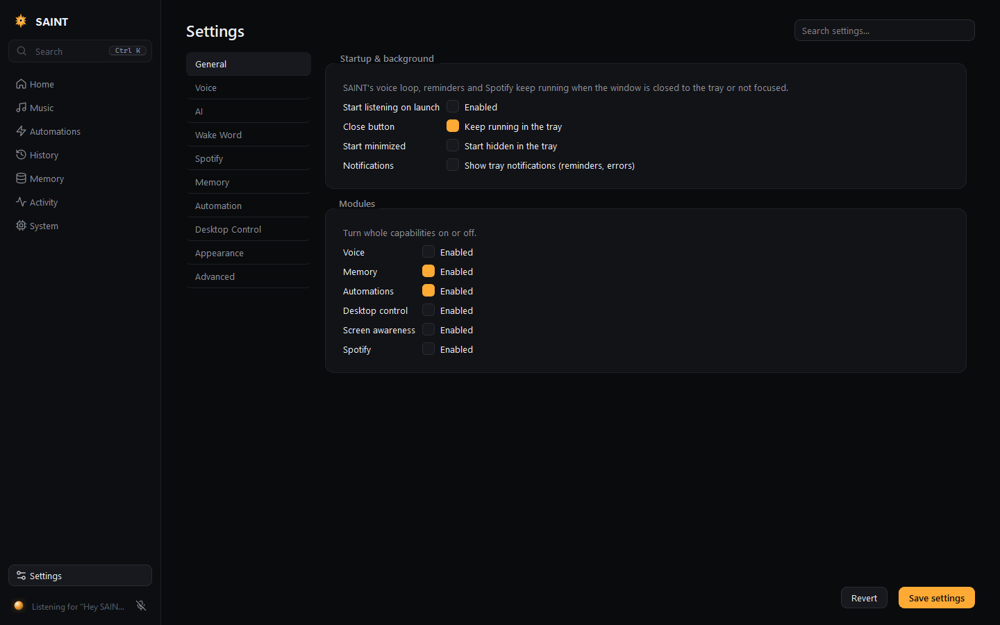

<p align="center"></p>

<h1 align="center">SAINT</h1>

<p align="center"><b>A local, voice-first AI assistant for Windows.</b><br>
Say “Hey SAINT” — it listens, does the real thing, and answers out loud. Everything runs on your PC.</p>

<p align="center">
  <a href="#installation">Install</a> ·
  <a href="#the-interface">Tour</a> ·
  <a href="#talking-to-saint">What you can say</a> ·
  <a href="#privacy-and-security">Privacy</a>
</p>



SAINT waits locally for its wake word, understands your request, remembers what you've told it, picks
the right tool, performs the real action and answers out loud — then goes back to listening. It
controls Spotify (with a personal listening memory), keeps long-term memory about you, runs reminders,
scheduled commands and multi-step scenes, and automates your desktop (apps, windows, keyboard, mouse,
UI elements). The language model runs locally through [Ollama](https://ollama.com).

## Highlights

- **Voice first.** A custom “Hey SAINT” wake model, GPU speech recognition, natural speech output,
  and interruptions that just work. After it answers, follow-ups need no wake word.
- **The Halo.** When SAINT is minimized, a soft light travels around the edge of your monitor —
  slow while it waits, bright and fast while it listens (breathing with your voice), twin comets while
  it thinks, and tinted by your album cover while music plays. It never blocks a click.
- **The overlay.** Press <kbd>Alt</kbd>+<kbd>`</kbd> anywhere — or rest your cursor at the top-centre edge of
  the screen — for a Steam-style overlay over whatever you're doing: ask anything, see what's playing,
  the conversation, what SAINT is doing, what's next, and your scenes.
- **Music, hands-free.** A floating always-on-top mini player with real album covers. While music plays,
  just say **“skip”**, **“pause”**, **“go back”**, **“louder”** — no wake word.
- **Scenes.** One phrase, many actions: “focus mode” → play lofi, set volume, open Notion. Run them by
  voice, from the overlay, or on a schedule.
- **History.** Everything you've asked and what SAINT did — with usage charts — stored only on your PC.
- **Command palette.** <kbd>Ctrl</kbd>+<kbd>K</kbd> jumps to any page, runs scenes and actions, or asks
  SAINT directly.
- **Private by design.** Wake word, speech, voice and language model are all local. Nothing about you
  is uploaded.

## What's new in this version

A ground-up rewrite of the interface:

- New minimal design system: near-black surfaces, hairline borders, one accent, a monoline icon set,
  and motion everywhere it helps (page transitions, a sliding nav pill, a living state orb, cross-fading
  covers, toasts). One switch in Settings turns all animation off.
- **Halo**, **overlay** (global hotkey + edge tab), **floating mini player**, **music hot-words**,
  **scenes**, **History** with usage stats, **command palette**, and a merged **System** page (health,
  latency, modules).
- **Demo mode** — SAINT drives its own UI for 30 seconds (wake word, a request, music, a hands-free
  skip, the palette and the overlay). It's fully scripted: nothing real runs, nothing is written to your
  history. Start it from the palette, the overlay or the tray; <kbd>Esc</kbd> stops it.
- Sharp album art everywhere (SAINT now uses Spotify's 640 px cover), loaded off the UI thread.
- **Fixes from live testing:** follow-ups without the wake word now work while music plays (anything
  SAINT recognises as a command is kept; chatter and lyrics are ignored), one-word commands ("pause",
  "skip") are no longer dropped for low speech-recognition confidence, a long request said with
  pauses arrives as one command, run-on multi-step requests ("open my browser search YouTube for …")
  are split correctly, "find the settings button" / "the X button in the top right" / "the recycle bin"
  find the right element (including on the taskbar and desktop), new commands ("hide everything except
  Spotify", "open a new tab", "summarize this page", "open my Monkeytype browser"), news questions answered
  from the Google News feed, and the overlay shows your Spotify queue.

| | |
|---|---|
|  |  |
| **Overlay** — over whatever you're doing | **Halo** — light around the screen edge, plus the mini player |
|  |  |
| **Music** — cover-tinted player, hands-free words, queue | **History** — local usage stats and timeline |
|  |  |
| **Scenes** — one phrase, many actions | **System** — health, latency, modules |

<sub>Screenshots are generated by `tools/dev/screenshots.py` from synthetic demo data (fictional tracks
with generated covers) — no personal data.</sub>

---

## Contents

- [Highlights](#highlights)
- [What works today](#what-works-today)
- [Architecture](#architecture)
- [Requirements](#requirements)
- [Installation](#installation)
- [Running SAINT](#running-saint)
- [Talking to SAINT](#talking-to-saint)
- [Wake word](#wake-word)
- [Speech recognition (STT) and speech output (TTS)](#speech-recognition-stt-and-speech-output-tts)
- [Interrupting SAINT](#interrupting-saint)
- [AI provider / Ollama](#ai-provider--ollama)
- [Spotify](#spotify)
- [Memory](#memory)
- [Reminders and automations](#reminders-and-automations)
- [Desktop control and permissions](#desktop-control-and-permissions)
- [Screen awareness](#screen-awareness)
- [The interface](#the-interface)
- [Configuration](#configuration)
- [Logging and debugging](#logging-and-debugging)
- [Tests](#tests)
- [Troubleshooting](#troubleshooting)
- [Project layout](#project-layout)
- [Privacy and security](#privacy-and-security)

---

## What works today

Everything below was verified on the development machine: Windows 11, RTX 5060 Ti, Python 3.14,
Ollama 0.34 with `llama3.1`. The check combined the automated tests with a live end-to-end run of the
real runtime (wake model, faster-whisper, agent, Ollama, Kokoro TTS, scheduler and desktop tools).
That live run fed synthesized speech into SAINT's voice loop in place of the microphone.

| Area | Status |
|---|---|
| Wake word "Hey SAINT" and "SAINT" | ✅ Two stages: the local ONNX model (CPU, ~1 ms per 80 ms frame) plus a transcript check for short utterances the model misses (it barely scores a bare "SAINT"). On synthetic speech from 4 voices, clean and with music at −8 dB, 64/64 wake decisions were correct, with no false wakes on "paint", "She is a saint" or plain commands. Background speech is never acted on or shown. |
| Conversation mode (no wake word for follow-ups) | ✅ After SAINT answers, follow-ups such as "skip that" or "turn it down" work for 15 s (configurable), counted from when SAINT stops talking. While music plays, only follow-ups SAINT recognises as commands (or short questions to it) are taken, so lyrics and chatter are ignored. Verified live. |
| Wake → command → STT → agent → tool → TTS → back to wake listening | ✅ |
| Interrupting SAINT while it talks (barge-in) | ✅ Your speech interrupts it and SAINT's own voice doesn't. The interrupting request is then processed. |
| Memory ("my favorite language is Python" → later "what language do I like?") | ✅ Persists across restarts. You can view, edit and delete memories. |
| Reminders, timers, recurring reminders, scheduled commands | ✅ Persist across restarts, run in the background and can be cancelled. Reminders missed while SAINT was closed are delivered on start-up. |
| Desktop control: open/reuse/close apps, move/resize/snap windows across monitors, type, keys, click/double/right-click/hover UI elements, scroll | ✅ All through validated tools. Verified live on two monitors (see [the manual test checklist](docs/MANUAL_TESTING.md)). Existing windows are reused, and SAINT asks which one if several match. |
| Multi-step requests ("open my browser, search YouTube for X, click the first video and pause") | ✅ Planned, then executed step by step with observe → act → verify, one retry and a clarifying question when needed. Verified live. |
| LLM function calling for requests the command router doesn't recognise | ✅ With tool-capable Ollama models (`llama3.1`, `llama3.2`). |
| Spotify: search, play track/artist/album/playlist/genre, pause/resume/skip/back, volume, queue, add to playlist, listening memory, recommendations | ✅ Covered by tests against a simulated Spotify API. ⚠️ Not yet run against a live account on this machine (see [Spotify](#spotify)). |
| Screen understanding ("what's on my second screen?", "what am I looking at?", "what is this error?") | ✅ From Windows APIs + UI Automation: monitors, windows per monitor, focus, buttons, links, fields, tabs, visible text. Image-level description additionally needs a vision-capable Ollama model (none is bundled). |
| Halo, overlay (global hotkey + edge tab), mini player, demo mode | ✅ Verified live with the real runtime. The Halo costs ~0.1–0.3 % CPU while animating. |
| Music hot-words ("skip", "pause", "louder" with no wake word while music plays) | ✅ Tested end-to-end through the voice loop with synthetic audio. ⚠️ One-word hot-words were fixed after a live run (Whisper scores single words near zero confidence) and need a live re-check. |
| Scenes (voice phrase, "run …", UI, schedule) and History | ✅ Covered by automated tests. |

### Known limitations

- **Bare "SAINT" relies on the transcript check.** The bundled `hey_saint.onnx` detects **"Hey SAINT"**
  well but barely scores a bare "SAINT" (≤ 0.02). A short utterance the model misses is transcribed
  once and accepted only if it *starts* with "SAINT" / "Hey SAINT". This costs one quick STT pass per
  short passive utterance, and none for speech longer than 7 s. Retraining with more bare-word
  samples would make the first stage catch it too (see [Retraining](#retraining)).
- **Wake-word accuracy on real voices** was measured on synthetic voices and background speech in
  the room. Tune it in Settings → Wake Word. A very low threshold (≈ 0.05) makes a bare "SAINT"
  reliable but can fire mid-sentence; SAINT keeps the rest of the request as one command either way.
- **Barge-in is energy based, not full acoustic echo cancellation.** With headphones it's excellent.
  With loud speakers right next to the microphone, raise *Echo margin* (Settings → Voice) if SAINT
  interrupts itself, or lower it if interrupting is too hard.
- **Smart Shuffle** isn't in Spotify's Web API. SAINT toggles it through the Spotify desktop app's own
  button (UI Automation) and falls back to regular shuffle when the app isn't open. **Removing songs
  from the queue** isn't possible through the API at all, and SAINT says so.
- **Spotify genre data** is no longer returned to new apps, so "something like X" uses the artist,
  their collaborators and your own listening history.
- **Web pages** are read through the browser's accessibility tree. Pages that don't expose their
  content (canvas apps, some games) can't be clicked by name; use coordinates or a vision model.

---

## Architecture

```
MICROPHONE (sounddevice, 30 ms frames)
   │
   ├─ VAD: Silero (speech vs. music/TV, from faster-whisper) with an RMS fallback
   ├─ Wake word, stage 1: onnxruntime (CPU) melspectrogram → embeddings → hey_saint.onnx
   │      fires when N of the last W frames clear the threshold (or one frame is very confident)
   └─ Wake word, stage 2: a short utterance the model missed is transcribed once and accepted
          only if it *starts* with "SAINT" / "Hey SAINT" (otherwise dropped; nothing is shown or logged)
          ▼
   WAKE_DETECTED → COMMAND_LISTENING   ("Hey SAINT, play jazz" and "SAINT … play jazz" both work)
          ▼
   STT: faster-whisper (GPU) → transcript with the wake phrase stripped
          ▼
   CONVERSATION MANAGER ──► after SAINT answers: conversation window (no wake word needed)
          ▼
   AGENT
     1. pending question?  (yes/no confirmations, "which window?" choices)
     2. reminders / memory
     3. multi-step plan  → OBSERVE → ACT → VERIFY → (retry once / ask) → next step
     4. single intents: system · Spotify · desktop/screen/browser (desktop_intents) · legacy desktop
     5. otherwise the LLM (Ollama) with memories, the real clock and tool calling
          ▼
   TOOL REGISTRY  (typed parameters, validation, permission policy, confirmation, events, logs)
     spotify.* · memory.* · automation.* · desktop.* · screen.* · browser (open_url / web_search)
          ▼
   RESULT + VERIFICATION (window moved? page changed? track changed?)
          ▼
   OUTPUT GUARD (modules/agent/output.py): no JSON, tool names, schemas, code or unbacked
   "I did X" claims ever reach the chat or TTS
          ▼
   RESPONSE → TTS (Kokoro, GPU) → conversation window → back to WAKE_LISTENING
```

Key ideas:

- **One authoritative state.** `core/assistant_state.py` holds `WAKE_LISTENING`,
  `WAKE_DETECTED`, `COMMAND_LISTENING`, `PROCESSING`, `EXECUTING`, `SPEAKING`, `OFFLINE` and `ERROR`.
  The voice loop, conversation controller and tool registry drive it; the UI only renders it.
- **Independent of the UI.** `core/runtime.py` starts TTS, the conversation controller, the
  wake-word listener and the scheduler. Core services receive events directly on the emitting thread
  (`event_bus.subscribe`); only UI widgets receive them through Qt. SAINT keeps working when the
  window is minimised, hidden to the tray or not focused.
- **No pretending.** Actions go through explicit tools, and SAINT's reply is built from the tool's
  actual result. Failures are reported plainly (e.g. "Spotify isn't connected"). The LLM is told the
  real time and only the memories you stored.
- **No shell for the LLM.** Shell and file tools exist for the owner but are never offered to the
  model. High-risk tools require confirmation.

---

## Requirements

- **Windows 10/11** (desktop control uses Win32 and UI Automation).
- **Python 3.12+** (developed and tested on 3.14).
- **Ollama** for the language model (optional, but SAINT can only chat with a model).
- **NVIDIA GPU recommended.** STT and TTS fall back to the CPU, at lower speed. The RTX 50-series
  (Blackwell) needs the CUDA 12.8 PyTorch wheels.
- A microphone and speakers or headphones.

---

## Installation

```bat
git clone https://github.com/uberdiz/SAINT.git
cd SAINT
setup.bat
```

`setup.bat` creates `.venv` and installs the CUDA PyTorch build when it finds an NVIDIA GPU. It then
installs `requirements.txt`, pulls `llama3.1` into Ollama (if Ollama is installed) and runs the tests.

Manual install:

```bat
python -m venv .venv
.venv\Scripts\activate
pip install --index-url https://download.pytorch.org/whl/cu128 torch torchaudio   & rem GPU; omit the index URL for CPU
pip install -r requirements.txt
ollama pull llama3.1
```

Models downloaded on first use: the faster-whisper STT model (e.g. `base.en`, ~150 MB) and the
Kokoro TTS model and voices (~330 MB, from Hugging Face). The wake-word models ship with the repo in
`data/wake/`.

---

## Running SAINT

```bat
run.bat                 & rem or: .venv\Scripts\python app.py
run.bat --background    & rem start hidden in the system tray
```

- SAINT starts listening for **"Hey SAINT"** straight away (turn this off in Settings → General).
- Closing the window keeps SAINT running in the **system tray** — the Halo around your screen shows
  it's still listening, and <kbd>Alt</kbd>+<kbd>`</kbd> opens the overlay. Right-click the tray icon to
  start/stop listening, toggle the Halo or mini player, run the demo, or quit.
- Only one instance runs at a time.

---

## Talking to SAINT

Say **"Hey SAINT"** or **"SAINT"**, then your request, in one breath or after a short pause. After
the wake word SAINT plays a soft chime and waits up to 6 seconds for the command. **After it answers,
just keep talking**: for 15 seconds (Settings → Wake Word → *Conversation window*) follow-ups like
"skip that", "turn it down" or "now put it on the left" need no wake word. While music is playing,
SAINT only takes follow-ups it recognises as commands (or short questions to it), so song lyrics and
people talking don't trigger anything; say "Hey SAINT" first for anything else, even mid-conversation.
Long requests can be said with natural pauses between the steps. You can also type into the
Home page, the overlay or the command palette; typed text goes through exactly the same agent.

**Music hot-words.** While Spotify is playing (or paused with the mini player on screen), a short
playback command on its own works with **no wake word at all**: "skip", "skip this song", "next song",
"go back", "pause", "resume", "louder", "quieter", "turn it up", "I love this". The whole utterance must
be one of these, so lyrics and conversation around you are ignored. It rides on the wake word's existing
transcript check, so it costs nothing extra. Turn it off in Settings → Spotify → *Hands-free*.

References carry over: "it", "that", "that window", "there" and "the first one" mean the thing SAINT
just worked with, unless you've switched to another window since. "Turn it down" means Spotify after
a music command and the computer volume after a video. With several matching windows SAINT asks
("I found 3 browser windows: 1, … Which one?"). Answer "the second one", "the YouTube one" or "the one
on my second screen".

| You say | What happens |
|---|---|
| "Hey SAINT, play Blinding Lights by The Weeknd" | Resolves the actual track on Spotify and plays it |
| "…play Daft Punk" / "…play the album Discovery" / "…play my gym playlist" / "…play some jazz" | Artist / album / your playlist / genre playlist |
| "…pause" · "resume" · "skip" · "go back" · "turn it up" · "set the volume to 30" | Playback control |
| "…play something else" · "play a different song" · "change the song" · "I'm not feeling this one" | Skips (the last also records a dislike). Never treated as a song title. |
| "…play something like DAMN by Kendrick Lamar" · "play something by Kendrick Lamar" | Picks similar music from that album/track/artist · plays that artist |
| "…turn on Smart Shuffle" · "replay this song" · "skip ahead 30 seconds" · "who is this?" | Smart Shuffle (via the Spotify app), restart, seek, current artist |
| "…what am I listening to?" · "what have I listened to today?" | Live playback state · SAINT's listening memory |
| "…play something I'd like" · "play something similar" · "recommend something similar" | Personalised picks from your real listening history |
| "…add this to my chill playlist" · "queue Harder Better Faster Stronger" | Real playlist/queue changes |
| "…my favorite programming language is Python" | Stored in long-term memory |
| "…what programming language do I like?" | Answered from memory ("Your favorite programming language is Python.") |
| "…forget my favorite programming language" · "what do you know about me?" | Delete / list memories |
| "…remind me at 5 PM to work on AIDE" · "remind me in 30 minutes" · "set a timer for 10 minutes" | One-time reminders |
| "…every morning remind me to check my schedule" · "remind me every weekday at 8:30 to stand up" | Recurring reminders |
| "…every weekday at 9 play my focus playlist" | Scheduled command |
| "…what reminders do I have?" · "cancel the stretch reminder" | Manage automations |
| "…focus mode" · "run wind down" · "start the morning scene" | Runs a [scene](#scenes) you made |
| "skip" · "pause" · "louder" (music playing, no wake word) | Music hot-words |
| "…open Discord" · "switch to Spotify" · "close Notepad" (asks first) | Apps and windows |
| "…move this window to my second monitor" · "snap Chrome to the left" · "maximize this window" | Window placement |
| "…type hello world into the search box" · "press ctrl+t" · "click the send button" | Keyboard and UI elements |
| "…open my browser" · "open YouTube" · "search YouTube for Kendrick Lamar" | Reuses your browser window (asks if several) · site search |
| "…click the first video" · "in that window, click the first result" · "click the button in the bottom right" | Finds visible results/elements (UI Automation) and verifies the page changed |
| "…scroll down" · "go back" · "refresh" · "copy that" · "put it in fullscreen" · "double click the recycle bin" | Scrolling, navigation, editing keys, element actions |
| "…move the browser to my second monitor" · "make it bigger" · "put it on the left" · "put this window next to Spotify" · "close all the browser windows" | Window management (closing asks first) |
| "…open my browser, search YouTube for Kendrick Lamar, click the first video, and turn the volume down" | Multi-step plan, each step verified |
| "…what's on my second screen?" · "what am I looking at?" · "what's currently open?" · "what is this error?" | Screen understanding per monitor. "Error" answers only from text actually on screen. |
| "…stop" (while SAINT is talking) | Stops speaking |

Anything else goes to the language model, which can also call the same tools.

---

## Wake word

- Model: `data/wake/hey_saint.onnx`, your custom openWakeWord classifier trained on "hey saint" and
  "saint", with near-miss negatives such as "faint", "paint" and "saved".
- Runtime: `modules/voice/wake_word.py` runs openWakeWord's three-stage pipeline (mel-spectrogram →
  speech embedding → classifier) **directly on onnxruntime**. Its scores match the reference
  openWakeWord implementation to within 0.0003. SAINT does not import the `openwakeword` package,
  because it pulls in scikit-learn, which Windows Application Control blocked on the development
  machine.
- **Stage 1 (model):** fires when *confirmation frames* (default 1) of the last *detection window*
  frames (default 4 × 80 ms) score ≥ *threshold* (default 0.50), or one frame is very confident, outside
  a *cooldown* (default 2 s). Strictly consecutive frames (the old rule) missed clear "Hey SAINT"s that
  peaked for a single frame. On 50 synthetic near-miss phrases ("paint", "sent", "Hey Sam", "She is a
  saint", …) nothing fired at thresholds down to 0.2.
- **Stage 2 (transcript check):** a short passive utterance (≤ 7 s) the model didn't fire on is
  transcribed once. It's accepted only if it starts with "SAINT" / "Hey SAINT". "SAINT, <pause> skip
  this" is judged as one utterance, and very short clips are padded so Whisper doesn't hallucinate on
  them. Bystander speech is never shown, acted on or logged.
- **Music:** the Silero VAD separates speech from music (0 % of loud synthetic music counted as speech,
  vs 62 % with the old energy VAD), so commands end cleanly while music plays. Utterances are capped
  at 15 s.
- While SAINT itself is speaking, wake detections are ignored so it can't wake itself. Interrupting is
  handled by barge-in (below), and the conversation window only starts counting once SAINT stops
  talking.
- If the model file is missing or invalid, Home and Settings show the exact error. SAINT
  then falls back to transcript-gated listening; nothing is faked.

Settings → **Wake Word**: enable/disable, model file, sensitivity, confirmation frames, detection
window, transcript check (and its length limit), cooldown, command timeout, conversation window,
follow-up confidence, chime, score logging, and a live score meter. Settings → **Voice**: speech
detector (Silero/RMS), longest utterance.

### Retraining

`hey_saint.onnx` was trained locally with
[Open-Wake-Word-Training](https://github.com/DisasterofPuppets/Open-Wake-Word-Training) (a Windows
wrapper around openWakeWord and Piper), using the config in `tools/wake_word/hey_saint.yaml`. To
improve bare-"SAINT" detection, increase the weight or number of `saint` samples and retrain:

1. Use Python 3.12 (`uv venv --seed --python 3.12`) and replace `webrtcvad` with `webrtcvad-wheels`.
2. Build in a **short path** such as `C:\oww`; torch's CUDA headers exceed Windows' 260-character limit.
3. `python install.py --gpu`, then download the training assets (~16 GB).
4. Delete stray `README.txt` files inside the augmentation asset folders.
5. Train: `python openWakeWord/openwakeword/train.py --training_config config/hey_saint.yaml --generate_clips --augment_clips --train_model`.
6. The model is `training/hey_saint.onnx`; the TFLite conversion step afterwards fails, which is
   harmless. If a `hey_saint.onnx.data` file is produced next to it, merge it into one file:
   ```python
   import onnx
   m = onnx.load("training/hey_saint.onnx", load_external_data=True)
   onnx.save_model(m, "hey_saint.onnx", save_as_external_data=False)
   ```
7. Copy the result to `data/wake/hey_saint.onnx`, or point Settings → Wake Word at it.

---

## Speech recognition (STT) and speech output (TTS)

- **STT:** [faster-whisper](https://github.com/SYSTRAN/faster-whisper), `base.en` by default,
  float16 on CUDA. It only runs on speech captured after the wake word (or on every utterance when
  the wake word is off). SAINT biases it toward spelling "SAINT" correctly (`voice.stt_hotwords`).
  Typical latency here: 90–215 ms per command. Settings → Voice: model, device, precision, language.
- **TTS:** [Kokoro](https://github.com/hexgrad/kokoro), voice `af_heart`, on CUDA with CPU
  fallback. Out-of-dictionary words (names, bands) use the bundled espeak-ng fallback. Qwen3-TTS is
  available as an alternative engine.
- Device selection and CUDA diagnostics are centralised in `core/device.py` and logged at start-up.

---

## Interrupting SAINT

The microphone is **never muted** while SAINT speaks:

1. The TTS playback thread reports the level of every audio block it plays (`core/audio_echo.py`).
2. The voice loop compares microphone energy against the echo predicted from that level, using a
   continuously learned speaker-to-mic coupling. Only speech clearly above the predicted echo,
   sustained for about 240 ms, counts as you talking.
3. On barge-in SAINT stops speaking at once and captures what you're saying, including the start of
   the utterance. The request is then handled as an interruption, so the model knows its last answer
   was cut off.
4. A second, text-level echo filter drops transcripts that simply repeat SAINT's own words.

You can also say "stop" or "never mind", or press **Stop speaking**. Tune this in Settings → Voice →
Interruptions.

---

## AI provider / Ollama

1. Install [Ollama](https://ollama.com) and run `ollama pull llama3.1`. `llama3.2` also supports
   tool calling; `llama3.2:1b` is faster but weaker.
2. Settings → **AI**: provider `ollama`, model, base URL (`http://localhost:11434`). Use **Test
   connection** and **Refresh list** to check.

If the configured model isn't installed, SAINT uses the closest installed one and says so. If Ollama
isn't running, SAINT answers "I can't reach my language model right now…" and never makes up a
reply. An OpenAI-compatible endpoint also works (provider `openai`, with base URL and API key), but
tool calling is currently implemented for Ollama.

---

## Spotify

SAINT talks to the Spotify Web API through your own developer app.

1. Create an app at <https://developer.spotify.com/dashboard>.
2. Add the redirect URI **`http://127.0.0.1:8888/callback`** (or the one shown in Settings).
3. Settings → **Spotify**: enable Spotify, paste the **Client ID**, press **Connect Spotify** and log
   in through the browser. SAINT uses Authorization Code + PKCE, so no client secret is needed. Tokens
   are stored in the **Windows Credential Manager** (`keyring`), never in files or logs.
4. Playback control requires **Spotify Premium** (a Spotify API rule).

What SAINT does:

- **Resolves real entities.** It searches tracks, artists, albums and playlists, and picks the best
  match with fuzzy scoring. "X by Y" means a track; "my … playlist" searches your playlists first;
  "some jazz" finds a genre playlist.
- **Recovers when no device is active.** It activates your preferred or most recent device, or opens
  the Spotify desktop app and waits for it.
- **Keeps a listening memory** (`data/memory/spotify_memory.db`): tracks actually observed playing
  (a background poller every 15 s), what you asked for, what you skipped and how far in, songs added
  to playlists, and whether you kept or skipped its recommendations. Artist genres are cached for
  genre-level taste.
- **Personalised picks** ("play something I'd like") are ranked from that memory and your Spotify top
  artists, excluding recently played and skipped tracks. With no history yet, SAINT says so instead
  of guessing. Spotify retired its `/recommendations` endpoint for new apps, so SAINT builds
  candidates from search.

Status: the Spotify layer is covered by automated tests against a simulated API, including device
recovery, skips and honest failures. On the development machine no Spotify account was connected, so
live playback wasn't exercised. Connect your account in Settings to use it.

---

## Memory

| Kind | Where | What |
|---|---|---|
| Short-term | RAM (`modules/ai/context.py`) | The current conversation (last N turns). Not persisted. |
| Long-term | `data/memory/saint_memory.db` | Facts you tell SAINT, stored as key/value (`favorite programming language = Python`), with categories *preference*, *personal*, *fact* and *project*. Saying something again updates it; the old value is kept in its history. |
| Spotify | `data/memory/spotify_memory.db` | Listening history, requests, skips, feedback, playlist aliases, genres. |
| Automations | `data/memory/automations.db` | Reminders and scheduled commands. |
| Scenes | `data/scenes.json` | Your scenes. |
| History | `data/history.jsonl` | What you asked, how (voice, typed, hot-word, scene), SAINT's reply, tools used and timings. Powers the History page. Local only; turn it off or cap its size in Settings → Memory, clear or export it on the History page. |

SAINT only stores clear personal statements ("my favorite X is Y", "call me Sam", "I live in…",
"remember that…"). It does not store every conversation. Answers such as "Your favorite programming
language is Python" come straight from the database. The LLM receives only the relevant stored
memories and is told not to invent others.

Inspect, add, edit and delete memories on the **Memory** page, or by voice ("what do you know about
me?", "forget my …"). Settings → Memory controls extraction, context injection and wiping.

---

## Reminders and automations

- **Time expressions:** "at 5 PM", "at 17:30", "at noon", "in 30 minutes", "in an hour and a half",
  "twenty minutes from now", "tomorrow at 9", "tonight", "on Friday", "every morning", "every weekday
  at 8:30", "every Monday and Thursday at 7 PM", "every 2 hours", "set a timer for 10 minutes".
- **Reminders** are spoken (TTS) and shown as a tray notification.
- **Scheduled commands** run any command through the agent at the set time, with the same tools and
  permissions, e.g. "every weekday at 9 play my focus playlist". Optional condition: "…if Spotify is
  playing" or "…is not playing".
- **Persistence:** the SQLite store survives restarts. One-time reminders missed while SAINT was
  closed are delivered on start-up if they're within *missed_grace_hours* (default 12); recurring
  ones resume on schedule.
- **Management:** Automations → **Scheduled** (create with a live preview of how the time was
  understood; pause, resume, run now, cancel, delete) or by voice.

### Scenes

A scene is a name, an optional extra voice phrase, and a list of commands run in order — anything you
could say to SAINT (“play lofi beats”, “set volume to 35”, “open notion”). Create them in Automations →
**Scenes** (templates included), then trigger them by saying the name or phrase (“Hey SAINT, focus
mode”, “run wind down”), from the overlay, Home or the command palette, or on a schedule (“every
weekday at 8”). Scenes are stored in `data/scenes.json`; a scheduled scene is an ordinary scheduled
command that says “run <name>”, so it survives restarts like any other automation.

---

## Desktop control and permissions

Every desktop action is an explicit tool with validated inputs:

| Tool | Notes |
|---|---|
| `desktop.open_app` | **Reuses a running app's window** instead of launching a duplicate. With several windows it picks the one the request, your focus or the conversation points at, else asks. "Browser" means the running or default browser; "a new window" really opens one. Resolved only against what's installed. Launched without a shell. |
| `desktop.close_app` / `desktop.close_windows` | Graceful `WM_CLOSE`, then the title-bar close command. **Asks for confirmation** by default (always for "close all …"). Reports honestly if the app stays open (e.g. a save prompt). |
| `desktop.scale_window`, `desktop.place_beside` | "Make it bigger", "put this next to Spotify". Results are measured afterwards. |
| `desktop.open_url`, `desktop.web_search` | Navigate / search sites (YouTube, Google, Amazon, …) in your existing browser window. Verified by the page title changing. |
| `desktop.focus_window`, `desktop.move_window`, `desktop.arrange_window`, `desktop.resize_window` | Switch, move to monitor N/next/left/right, maximise/minimise/snap/centre. |
| `desktop.type_text` | Unicode typing via SendInput, optionally into a named field ("search box") found through UI Automation. Length-limited. |
| `desktop.press_keys` | Key names are validated; Alt+F4, Win+L, Ctrl+Alt+Del, Win+R and Win+X are refused. |
| `desktop.click_element` / `desktop.list_ui_elements` | Real UI elements from the Windows accessibility tree, by label, position ("button in the bottom right") or order ("first video": visible results only, sidebar and off-screen carousel items skipped). Click, double, right, middle and hover. Reports whether the UI changed. |
| `desktop.mouse_move` / `desktop.mouse_click` / `desktop.drag` / `desktop.scroll` | Coordinates checked against the virtual screen. Scrolling moves the pointer over the intended window first. |

Commands act on the window SAINT is working with, unless you've switched to another window since.
They never act on SAINT's own window when you typed into it. Keyboard input only goes to a window
that was verified to be in front. The process is per-monitor DPI aware, so coordinates stay exact
with mixed display scaling.

Safety:

- **Permission mode** (Settings → Automation): *Safe* (low-risk only), *Confirm* (default: high-risk
  actions ask first) or *Autonomous*. Per-tool overrides (allow/confirm/deny) are in Settings →
  Desktop Control.
- **Switches** for app launching, window control, keyboard and mouse.
- The LLM never gets `run_command`, `write_file` or background shell tasks.
- pyautogui's fail-safe stays on: move the mouse into a screen corner to abort mouse automation.

---

## Screen awareness

| Stage | Status |
|---|---|
| Screen capture (`screen.capture`, all monitors or one) | ✅ |
| Window / monitor / focus context | ✅ |
| UI element understanding: buttons, fields and links of the active window (Windows UI Automation) | ✅ |
| Visual analysis of the image | ⚠️ Only with a vision-capable Ollama model (Settings → Advanced → Vision, e.g. `llama3.2-vision`). Otherwise SAINT says it's not configured. |
| Action planning → mouse/keyboard | ✅ Through the desktop tools. The LLM can combine `screen.context` with `desktop.*`. |

`screen.context` covers every monitor: which is the main one, where each sits, resolution and
scaling, and the windows on it, front-most first. For the window you're looking at, or the front
window of the monitor you asked about, it lists buttons, links, fields, menus, tabs and visible
text. It runs on demand only; nothing is captured in the background. "What's on my screen?", "What's
on my second screen?" and "What's currently open?" answer from this. Image analysis is added when a
vision model is configured, and is told to say when it can't tell rather than guess. Settings →
Vision → *Screen reading* turns it off.

---

## The interface

Everything you see is driven by real events from the core runtime — the UI never guesses what SAINT is
doing.

| Page | What it shows |
|---|---|
| **Home** | The state orb (colour, breathing, rings and ripples follow the real assistant state and your voice), wake-word status with live score and mic meters, the conversation with typed input, now playing, a **Live** feed of tools as they run, what's up next, one-click scenes, and system stats. |
| **Music** | A cover-tinted now-playing hero (sharp album art, live progress, shuffle / previous / play / next / like / volume), the hands-free words, your queue and quick actions. |
| **Automations** | **Scenes** (editor with templates, voice phrase, steps, optional schedule, run now) and **Scheduled** reminders and commands. |
| **History** | Totals, today, last 7 days, how much you use SAINT hands-free, a 30-day chart, your most-used tools and a searchable, filterable timeline. Export or clear it. |
| **Memory** | Long-term memories (search, filter, add, edit, delete) and your music memory. |
| **Activity** | Every event, live, with filters (voice, agent & tools, Spotify, problems) and pause. |
| **System** | Health (status, CPU, memory, uptime, language model reachability, STT, voice, wake word), voice-pipeline latency against goals, and module status. |
| **Settings** | General · Voice · AI · Wake Word · Spotify · Memory · Automation · Desktop Control · Appearance · Advanced, with search. |

**Beyond the window**

| | |
|---|---|
| **Halo** | Light around the screen edge while SAINT is minimized (or always — Settings → Appearance → *Halo*; one or all monitors). Four thin click-through windows, so it never blocks anything. |
| **Edge tab** | Rest the cursor at the top-centre edge of the screen for a moment and a small SAINT tab slides down; click it for the overlay. |
| **Overlay** | <kbd>Alt</kbd>+<kbd>`</kbd> (configurable) from anywhere. A frosted copy of your screen with SAINT on top: state, input, now playing, live tools, conversation, up next, scenes, and toggles for the Halo, mini player and demo. <kbd>Esc</kbd> or a click on the background closes it. |
| **Mini player** | Floating, always on top, draggable (it remembers where you put it). Double-click it to open Music. It flashes when it hears a hot-word. |
| **Command palette** | <kbd>Ctrl</kbd>+<kbd>K</kbd>: pages, scenes, music controls, the Halo, the mini player, theme, demo — or “Ask SAINT: …”. <kbd>Ctrl</kbd>+<kbd>1</kbd>…<kbd>8</kbd> jump to pages. |
| **Tray** | Open SAINT, open the overlay, mini player, Halo, start/stop listening, demo, quit. |

**Appearance** settings: dark, light or system theme; accent colour (presets or custom); font and
size; compact density; animations on/off; window opacity; always on top; sidebar labels; Halo, edge tab
and overlay hotkey. Changes apply immediately. On Windows 11 the title bar follows the theme.



---

## Configuration

- Settings are saved to **`data/config.json`**. It's created on first run, migrated automatically
  when new options are added, and written atomically. `data/` is git-ignored.
- All paths are **relative to the SAINT folder**, so there are no machine-specific paths. Set
  `SAINT_DATA_DIR` to keep runtime data elsewhere (the tests do this).
- Most settings apply live when you press **Save settings**: the wake word reloads, the microphone
  restarts, TTS re-initialises, and the log level and appearance update.

Main sections: `voice.*` (mic, VAD, barge-in, STT, TTS, wake word, `music_hotwords`), `ai.*`,
`agent.*`, `memory.*`, `history.*`, `automation.*`, `desktop.*`, `spotify.*`, `vision.*`,
`appearance.*`, `overlay.*` (Halo mode, all screens, edge tab, hotkey), `widgets.*` (mini player),
`notifications.*`, `permissions.overrides`, `logging.*`.

---

## Logging and debugging

- Log file: `data/logs/saint.log` (rotating, 2 MB × 5), also printed to the terminal.
- Recorded: wake detections and scores, listening state changes, STT results and latency, the
  selected intent, tool start/finish/failure with duration, Spotify actions and errors, memory
  operations, automation creation/execution, desktop actions, TTS start/stop, barge-ins and
  interruptions, and all errors.
- High-frequency events (audio levels, tokens, per-chunk TTS timing, wake scores) are never logged
  per occurrence.
- Settings → Advanced: log level (Verbose / Normal / Errors Only) and **Debug mode**. Settings →
  Wake Word → *Debug* logs every wake score above 0.1.

---

## Tests

```bat
.venv\Scripts\python -m pytest
```

329 automated tests cover:

- wake-word model loading, silence and noise rejection, the windowed trigger and cooldown
- music hot-words (accepted only while music is active, whole-utterance match, confidence floor)
- the local history log (sources, tools, trimming, off switch) and scenes (voice matching, schedules)
- a headless build of the whole UI: every page, the command palette, overlay, Halo, mini player, and
  demo mode never reaching the core (no real actions, nothing in your history)
- the listening state machine (transcript wake for bare "SAINT", passive speech never acted on,
  wake → command, the conversation window that waits while SAINT talks, timeouts)
- natural-language intent understanding: many phrasings per action, action phrases never becoming
  song titles, context-dependent meaning ("turn it down", "go back", "pause") and multi-step plans
- which window a command acts on, and answering "which one?" questions
- the echo gate, plus interruption handling in the conversation controller
- intent routing for Spotify, memory, reminder and desktop phrasing
- memory store, recall, update and delete, including persistence across a restart
- the scheduler (parse, persist, execute, missed reminders, recurring, cancel)
- tool validation, permissions and confirmations, and desktop safety checks
- Spotify resolution, device recovery and listening memory against a simulated API

Tests use a temporary data directory and mock STT, TTS and LLM backends, so they never touch your
settings, microphone, Spotify account or desktop. `tools/dev/` holds manual diagnostic scripts, and
`python tools/dev/screenshots.py` regenerates the README screenshots from synthetic data.

Before a release, run through the **[manual testing checklist](docs/MANUAL_TESTING.md)** (voice,
Spotify, screen, mouse/keyboard, windows, browser, multi-step, natural answers).

---

## Troubleshooting

| Problem | Fix |
|---|---|
| Mic meter flat / SAINT never hears you | Settings → Voice → Input device, then **Test (3 s)**. With Voicemeeter, make sure your microphone is actually routed to the bus SAINT listens on (e.g. "Voicemeeter Out B1"). |
| Wake word never triggers | Say "**Hey** SAINT". Raise the sensitivity and watch the live score in Settings → Wake Word. Check the status line for model errors. |
| Wake word triggers on TV or speech | Lower the sensitivity or add a confirmation frame. |
| "Wake word unavailable" | The status line gives the reason (missing model, missing feature models, onnxruntime not installed). |
| SAINT interrupts itself | Raise Settings → Voice → Echo margin, lower the speaker volume or use headphones. |
| "I can't reach my language model" | Start Ollama (`ollama serve`) and check the base URL. |
| "Model … isn't installed" | `ollama pull llama3.1`, or pick an installed model in Settings → AI. |
| TTS on CPU / "CUDA unavailable" | Install the CUDA PyTorch build (see Installation). The reason is logged at start-up. |
| Spotify: "isn't connected" / "no device" / "needs Premium" | Connect in Settings → Spotify. Open Spotify on a device. Playback control needs Premium. |
| "I can't see a 'search box'" | The app doesn't expose that element through UI Automation; click into the field and say "type …" instead. |
| DLL "blocked by Application Control" | A Windows Smart App Control / WDAC policy blocks a compiled package. SAINT avoids scikit-learn for this reason; allow the package or use a different Python environment. Smart App Control can also intermittently block SciPy DLLs that Kokoro TTS loads — System shows TTS as not ready; restart SAINT or turn Smart App Control off. |
| "Overlay hotkey is taken" toast | Another app already owns that shortcut. Pick a different one in Settings → Appearance → *Overlay hotkey* (e.g. `ctrl+alt+s`). |
| No Halo | It shows while SAINT is minimized or in the tray (or always — Settings → Appearance → *Halo*). Exclusive-fullscreen games draw over it; borderless-windowed games don't. |
| “Skip” without the wake word does nothing | Hot-words work while Spotify is playing (or paused with the mini player showing). Check Settings → Spotify → *Hands-free*. |

---

## Project layout

```
app.py                  entry point (Qt app, tray, single instance, runtime start)
core/
  runtime.py            starts/owns TTS, conversation controller, voice, scheduler (UI-independent)
  assistant_state.py    authoritative assistant state
  conversation.py       turn orchestration, TTS queue, interruption, announcements
  audio_echo.py         playback monitor + echo gate (barge-in)
  events.py             event bus (direct core subscribers + Qt signal for UI)
  config.py, paths.py   settings (+ migration) and project-relative paths
  permissions.py        allow / confirm / deny policy
  history.py            local usage log (data/history.jsonl) behind the History page
  logger.py, device.py, analytics.py, state.py, setup.py
modules/
  voice/                mic capture, VAD, wake word (ONNX), STT, TTS
  agent/                intent router, confirmations, LLM tool calling
  automation/           tool registry, scheduler, time parser, scenes, background tasks
  spotify/              OAuth PKCE, API client, tools, listening memory
  memory/               SQLite store + structured memory service
  desktop/              apps, windows, keyboard/mouse, UI Automation
  vision/               screen capture, UI context, optional vision model
  ai/                   providers (Ollama/OpenAI-compatible/mock), context
ui/
  main_window.py        shell: sidebar, pages, tray, hotkey, palette, toasts
  pages/                home, music (+ NowPlaying), automations, history, memory, activity, system
  halo.py, overlay.py   screen-edge Halo + edge tab, Steam-style overlay
  spotify_widget.py     floating mini player
  palette.py, toast.py, demo.py
  reactive.py           ui_bus: the UI's view of SAINT (and the demo's scripted feed)
  theme.py, icons.py, motion.py, widgets.py, win.py, actions.py, settings_ui.py
data/wake/              wake-word models (committed); everything else in data/ is local
tests/                  pytest suite
tools/                  wake-word training config, dev scripts
```

---

## Privacy and security

- Wake word, speech recognition, speech output and the language model all run **locally**. Nothing
  is sent anywhere except Spotify API calls, and an OpenAI-compatible endpoint if you configure one.
- Secrets never go in the repo. Spotify tokens live in the Windows Credential Manager. `data/`
  (config, memories, history, scenes, logs) and `.env` files are git-ignored — a fresh clone starts
  clean, and your data stays on your PC.
- **History** is a plain local file (`data/history.jsonl`) you can turn off, cap, export or clear. It
  is never uploaded. Demo mode never writes to it.
- The overlay's frosted background is a snapshot of your screen taken the moment it opens; it's kept
  in memory only and dropped when the overlay closes.
- The LLM can only act through explicit, validated tools. It has no shell access, and high-risk
  actions need your confirmation.
