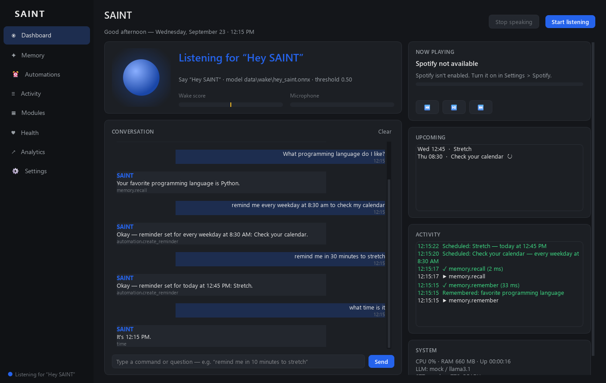
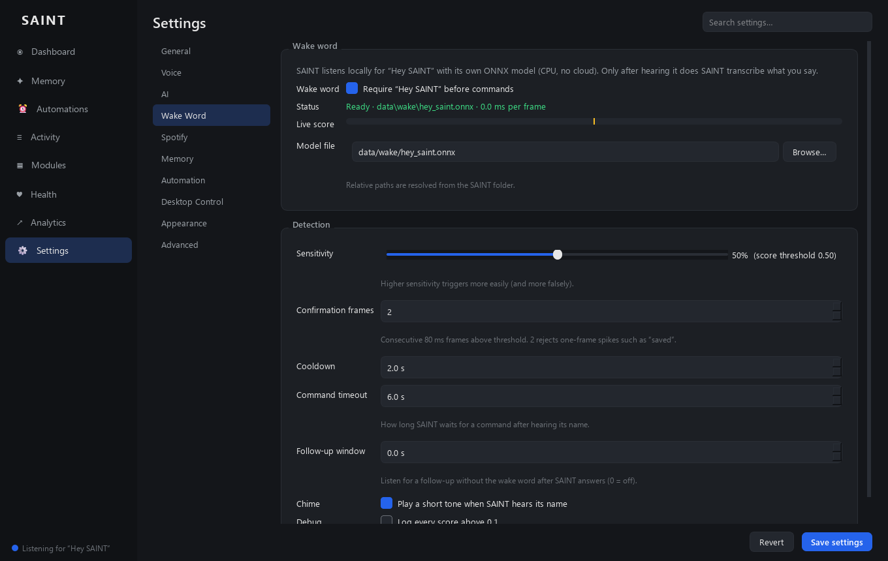
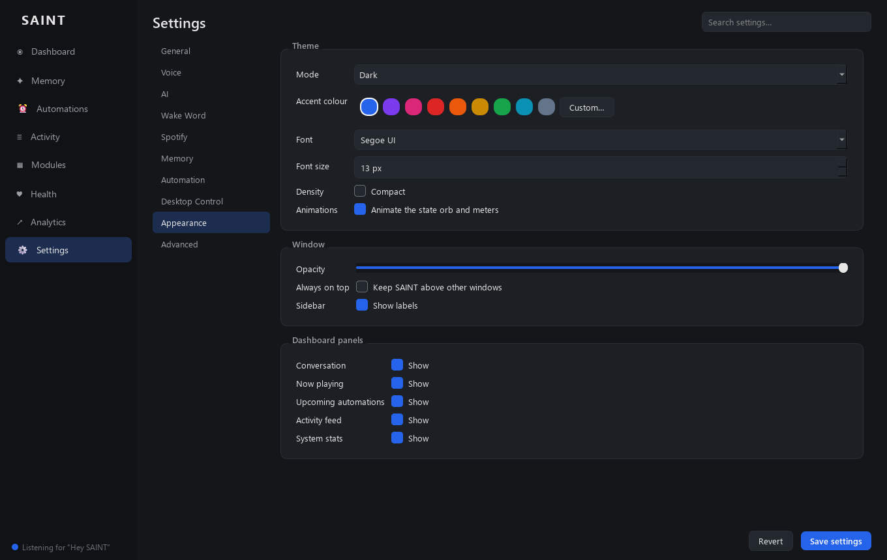
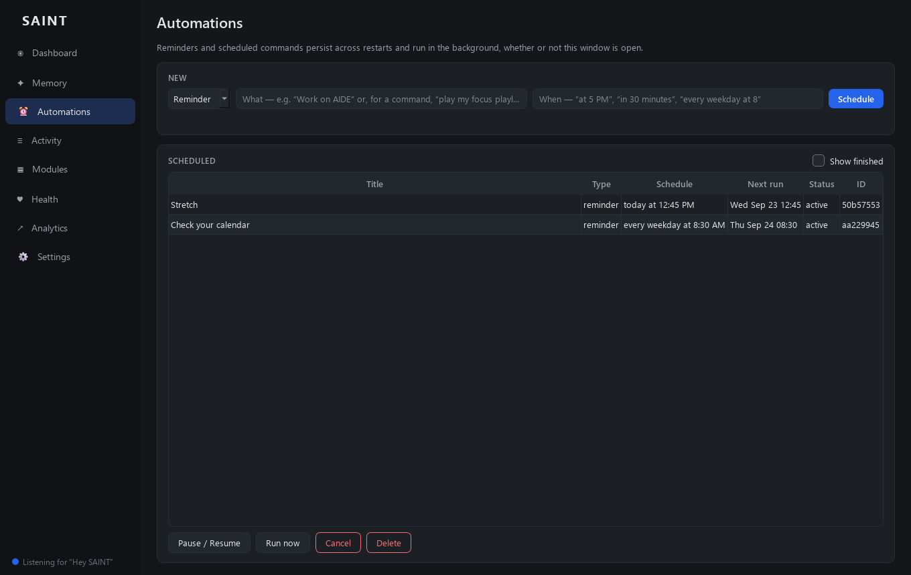
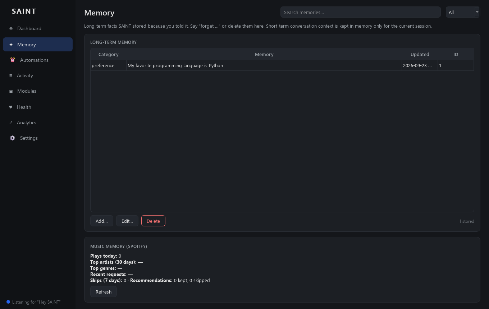

# SAINT

SAINT is a local AI assistant for Windows. It waits locally for its wake word ("Hey SAINT"),
understands your request, remembers what you've told it, picks the right tool, performs the real
action and answers out loud. Then it goes back to listening.

It covers Spotify control with a personal listening memory, persistent memory about you, reminders
and scheduled automations, and controlled desktop automation (apps, windows, keyboard, mouse, UI
elements). The language model runs locally through [Ollama](https://ollama.com).



<sub>Dashboard rendered offscreen with the mock language model and no microphone attached, which is why
the header offers "Start listening". Every panel is driven by real events from the core runtime.</sub>

---

## Contents

- [What works today](#what-works-today)
- [Architecture](#architecture)
- [Requirements](#requirements)
- [Installation](#installation)
- [Running SAINT](#running-saint)
- [Talking to SAINT](#talking-to-saint)
- [Wake word](#wake-word)
- [Speech recognition (STT) and speech output (TTS)](#speech-recognition-stt-and-speech-output-tts)
- [Interrupting SAINT](#interrupting-saint)
- [AI provider / Ollama](#ai-provider--ollama)
- [Spotify](#spotify)
- [Memory](#memory)
- [Reminders and automations](#reminders-and-automations)
- [Desktop control and permissions](#desktop-control-and-permissions)
- [Screen awareness](#screen-awareness)
- [The interface](#the-interface)
- [Configuration](#configuration)
- [Logging and debugging](#logging-and-debugging)
- [Tests](#tests)
- [Troubleshooting](#troubleshooting)
- [Project layout](#project-layout)
- [Privacy and security](#privacy-and-security)

---

## What works today

Everything below was verified on the development machine: Windows 11, RTX 5060 Ti, Python 3.14,
Ollama 0.34 with `llama3.1`. The check combined the automated tests with a live end-to-end run of the
real runtime (wake model, faster-whisper, agent, Ollama, Kokoro TTS, scheduler and desktop tools).
That live run fed synthesized speech into SAINT's voice loop in place of the microphone.

| Area | Status |
|---|---|
| Wake word "Hey SAINT" | ✅ Local ONNX model on the CPU (~3 ms per 80 ms frame). Background speech without the wake word is never transcribed. See [known limitations](#known-limitations). |
| Wake → command → STT → agent → tool → TTS → back to wake listening | ✅ |
| Interrupting SAINT while it talks (barge-in) | ✅ Your speech interrupts it and SAINT's own voice doesn't. The interrupting request is then processed. |
| Memory ("my favorite language is Python" → later "what language do I like?") | ✅ Persists across restarts. You can view, edit and delete memories. |
| Reminders, timers, recurring reminders, scheduled commands | ✅ Persist across restarts, run in the background and can be cancelled. Reminders missed while SAINT was closed are delivered on start-up. |
| Desktop control: open/close/switch apps, move windows between monitors, type, press keys, mouse, click UI elements | ✅ All through validated tools. Closing apps asks for confirmation. |
| LLM function calling for requests the command router doesn't recognise | ✅ With tool-capable Ollama models (`llama3.1`, `llama3.2`). |
| Spotify: search, play track/artist/album/playlist/genre, pause/resume/skip/back, volume, queue, add to playlist, listening memory, recommendations | ✅ Covered by tests against a simulated Spotify API. ⚠️ Not yet run against a live account on this machine (see [Spotify](#spotify)). |
| Image-level screen understanding | ⚠️ Needs a vision-capable Ollama model (none is bundled). Window and UI-element awareness through Windows UI Automation works without one. |

### Known limitations

- **Bare "SAINT" vs "Hey SAINT".** The bundled `hey_saint.onnx` reliably detects **"Hey SAINT"** (scores
  0.72–0.95 on synthetic voices). It does **not** detect the bare word "SAINT" (scores ≤ 0.02). Say
  "Hey SAINT", or retrain with more bare-word samples (see [Retraining](#retraining)).
- **Wake-word accuracy on real voices** is untested beyond synthetic speech; tune the sensitivity in
  Settings → Wake Word.
- **Barge-in is energy based, not full acoustic echo cancellation.** With headphones it's excellent.
  With loud speakers right next to the microphone, raise *Echo margin* (Settings → Voice) if SAINT
  interrupts itself, or lower it if interrupting is too hard.

---

## Architecture

```
MICROPHONE (sounddevice, 30 ms frames)
   │
   ├─ VAD (RMS, hysteresis) ── tentative speech buffer (never transcribed on its own)
   └─ Wake-word detector (onnxruntime, CPU): melspectrogram → embeddings → hey_saint.onnx
          │  "Hey SAINT" (score ≥ threshold for N frames, outside the cooldown)
          ▼
   WAKE_DETECTED → COMMAND_LISTENING  (the utterance that contained the wake word is kept,
          │                            so "Hey SAINT, play jazz" and "Hey SAINT … play jazz" both work)
          ▼
   STT: faster-whisper (GPU) → transcript with the wake phrase stripped
          ▼
   AGENT
     1. pending confirmation?  ("yes" / "no")
     2. deterministic intent router  (Spotify, memory, reminders, desktop, screen, clock)
     3. otherwise the LLM (Ollama) with relevant memories, the real clock and, for
        action-like requests, function calling over explicit tools
          ▼
   TOOL REGISTRY  (typed parameters, validation, permission policy, confirmation, events)
     spotify.* · memory.* · automation.* · desktop.* · screen.*
          ▼
   RESPONSE (built from the tool's real result or real error) → TTS (Kokoro, GPU)
          ▼
   back to WAKE_LISTENING
```

Key ideas:

- **One authoritative state.** `core/assistant_state.py` holds `WAKE_LISTENING`,
  `WAKE_DETECTED`, `COMMAND_LISTENING`, `PROCESSING`, `EXECUTING`, `SPEAKING`, `OFFLINE` and `ERROR`.
  The voice loop, conversation controller and tool registry drive it; the UI only renders it.
- **Independent of the UI.** `core/runtime.py` starts TTS, the conversation controller, the
  wake-word listener and the scheduler. Core services receive events directly on the emitting thread
  (`event_bus.subscribe`); only UI widgets receive them through Qt. SAINT keeps working when the
  window is minimised, hidden to the tray or not focused.
- **No pretending.** Actions go through explicit tools, and SAINT's reply is built from the tool's
  actual result. Failures are reported plainly (e.g. "Spotify isn't connected"). The LLM is told the
  real time and only the memories you stored.
- **No shell for the LLM.** Shell and file tools exist for the owner but are never offered to the
  model. High-risk tools require confirmation.

---

## Requirements

- **Windows 10/11** (desktop control uses Win32 and UI Automation).
- **Python 3.12+** (developed and tested on 3.14).
- **Ollama** for the language model (optional, but SAINT can only chat with a model).
- **NVIDIA GPU recommended.** STT and TTS fall back to the CPU, at lower speed. The RTX 50-series
  (Blackwell) needs the CUDA 12.8 PyTorch wheels.
- A microphone and speakers or headphones.

---

## Installation

```bat
git clone https://github.com/uberdiz/SAINT.git
cd SAINT
setup.bat
```

`setup.bat` creates `.venv` and installs the CUDA PyTorch build when it finds an NVIDIA GPU. It then
installs `requirements.txt`, pulls `llama3.1` into Ollama (if Ollama is installed) and runs the tests.

Manual install:

```bat
python -m venv .venv
.venv\Scripts\activate
pip install --index-url https://download.pytorch.org/whl/cu128 torch torchaudio   & rem GPU; omit the index URL for CPU
pip install -r requirements.txt
ollama pull llama3.1
```

Models downloaded on first use: the faster-whisper STT model (e.g. `base.en`, ~150 MB) and the
Kokoro TTS model and voices (~330 MB, from Hugging Face). The wake-word models ship with the repo in
`data/wake/`.

---

## Running SAINT

```bat
run.bat                 & rem or: .venv\Scripts\python app.py
run.bat --background    & rem start hidden in the system tray
```

- SAINT starts listening for **"Hey SAINT"** straight away (turn this off in Settings → General).
- Closing the window keeps SAINT running in the **system tray**. Right-click the tray icon to
  start/stop listening or quit.
- Only one instance runs at a time.

---

## Talking to SAINT

Say **"Hey SAINT"**, then your request, in one breath or after a short pause. After the wake word
SAINT plays a soft chime and waits up to 6 seconds for the command. You can also type into the
dashboard; typed text goes through exactly the same agent.

| You say | What happens |
|---|---|
| "Hey SAINT, play Blinding Lights by The Weeknd" | Resolves the actual track on Spotify and plays it |
| "…play Daft Punk" / "…play the album Discovery" / "…play my gym playlist" / "…play some jazz" | Artist / album / your playlist / genre playlist |
| "…pause" · "resume" · "skip" · "go back" · "turn it up" · "set the volume to 30" | Playback control |
| "…what am I listening to?" · "what have I listened to today?" | Live playback state · SAINT's listening memory |
| "…play something I'd like" · "play something similar" · "recommend something similar" | Personalised picks from your real listening history |
| "…add this to my chill playlist" · "queue Harder Better Faster Stronger" | Real playlist/queue changes |
| "…my favorite programming language is Python" | Stored in long-term memory |
| "…what programming language do I like?" | Answered from memory ("Your favorite programming language is Python.") |
| "…forget my favorite programming language" · "what do you know about me?" | Delete / list memories |
| "…remind me at 5 PM to work on AIDE" · "remind me in 30 minutes" · "set a timer for 10 minutes" | One-time reminders |
| "…every morning remind me to check my schedule" · "remind me every weekday at 8:30 to stand up" | Recurring reminders |
| "…every weekday at 9 play my focus playlist" | Scheduled command |
| "…what reminders do I have?" · "cancel the stretch reminder" | Manage automations |
| "…open Discord" · "switch to Spotify" · "close Notepad" (asks first) | Apps and windows |
| "…move this window to my second monitor" · "snap Chrome to the left" · "maximize this window" | Window placement |
| "…type hello world into the search box" · "press ctrl+t" · "click the send button" | Keyboard and UI elements |
| "…open Chrome and search for cats" | Multi-step: both steps run in order |
| "…what's on my screen?" · "take a screenshot" | Active window and controls (UI Automation) · capture |
| "…stop" (while SAINT is talking) | Stops speaking |

Anything else goes to the language model, which can also call the same tools.

---

## Wake word

- Model: `data/wake/hey_saint.onnx`, your custom openWakeWord classifier trained on "hey saint" and
  "saint", with near-miss negatives such as "faint", "paint" and "saved".
- Runtime: `modules/voice/wake_word.py` runs openWakeWord's three-stage pipeline (mel-spectrogram →
  speech embedding → classifier) **directly on onnxruntime**. Its scores match the reference
  openWakeWord implementation to within 0.0003. SAINT does not import the `openwakeword` package,
  because it pulls in scikit-learn, which Windows Application Control blocked on the development
  machine.
- Detection requires the score to stay ≥ *threshold* (default 0.50) for *confirmation frames*
  (default 2 × 80 ms), outside a *cooldown* (default 2 s). The two-frame rule removed the false
  triggers on "saved" seen in testing without losing any real "Hey SAINT".
- While SAINT itself is speaking, wake detections are ignored so it can't wake itself. Interrupting is
  handled by barge-in (below).
- If the model file is missing or invalid, the dashboard and Settings show the exact error. SAINT
  then falls back to transcript-gated listening; nothing is faked.

Settings → **Wake Word**: enable/disable, model file, sensitivity, confirmation frames, cooldown,
command timeout, follow-up window (listen for a follow-up without the wake word), chime, score
logging, and a live score meter.

### Retraining

`hey_saint.onnx` was trained locally with
[Open-Wake-Word-Training](https://github.com/DisasterofPuppets/Open-Wake-Word-Training) (a Windows
wrapper around openWakeWord and Piper), using the config in `tools/wake_word/hey_saint.yaml`. To
improve bare-"SAINT" detection, increase the weight or number of `saint` samples and retrain:

1. Use Python 3.12 (`uv venv --seed --python 3.12`) and replace `webrtcvad` with `webrtcvad-wheels`.
2. Build in a **short path** such as `C:\oww`; torch's CUDA headers exceed Windows' 260-character limit.
3. `python install.py --gpu`, then download the training assets (~16 GB).
4. Delete stray `README.txt` files inside the augmentation asset folders.
5. Train: `python openWakeWord/openwakeword/train.py --training_config config/hey_saint.yaml --generate_clips --augment_clips --train_model`.
6. The model is `training/hey_saint.onnx`; the TFLite conversion step afterwards fails, which is
   harmless. If a `hey_saint.onnx.data` file is produced next to it, merge it into one file:
   ```python
   import onnx
   m = onnx.load("training/hey_saint.onnx", load_external_data=True)
   onnx.save_model(m, "hey_saint.onnx", save_as_external_data=False)
   ```
7. Copy the result to `data/wake/hey_saint.onnx`, or point Settings → Wake Word at it.

---

## Speech recognition (STT) and speech output (TTS)

- **STT:** [faster-whisper](https://github.com/SYSTRAN/faster-whisper), `base.en` by default,
  float16 on CUDA. It only runs on speech captured after the wake word (or on every utterance when
  the wake word is off). SAINT biases it toward spelling "SAINT" correctly (`voice.stt_hotwords`).
  Typical latency here: 90–215 ms per command. Settings → Voice: model, device, precision, language.
- **TTS:** [Kokoro](https://github.com/hexgrad/kokoro), voice `af_heart`, on CUDA with CPU
  fallback. Out-of-dictionary words (names, bands) use the bundled espeak-ng fallback. Qwen3-TTS is
  available as an alternative engine.
- Device selection and CUDA diagnostics are centralised in `core/device.py` and logged at start-up.

---

## Interrupting SAINT

The microphone is **never muted** while SAINT speaks:

1. The TTS playback thread reports the level of every audio block it plays (`core/audio_echo.py`).
2. The voice loop compares microphone energy against the echo predicted from that level, using a
   continuously learned speaker-to-mic coupling. Only speech clearly above the predicted echo,
   sustained for about 240 ms, counts as you talking.
3. On barge-in SAINT stops speaking at once and captures what you're saying, including the start of
   the utterance. The request is then handled as an interruption, so the model knows its last answer
   was cut off.
4. A second, text-level echo filter drops transcripts that simply repeat SAINT's own words.

You can also say "stop" or "never mind", or press **Stop speaking**. Tune this in Settings → Voice →
Interruptions.

---

## AI provider / Ollama

1. Install [Ollama](https://ollama.com) and run `ollama pull llama3.1`. `llama3.2` also supports
   tool calling; `llama3.2:1b` is faster but weaker.
2. Settings → **AI**: provider `ollama`, model, base URL (`http://localhost:11434`). Use **Test
   connection** and **Refresh list** to check.

If the configured model isn't installed, SAINT uses the closest installed one and says so. If Ollama
isn't running, SAINT answers "I can't reach my language model right now…" and never makes up a
reply. An OpenAI-compatible endpoint also works (provider `openai`, with base URL and API key), but
tool calling is currently implemented for Ollama.

---

## Spotify

SAINT talks to the Spotify Web API through your own developer app.

1. Create an app at <https://developer.spotify.com/dashboard>.
2. Add the redirect URI **`http://127.0.0.1:8888/callback`** (or the one shown in Settings).
3. Settings → **Spotify**: enable Spotify, paste the **Client ID**, press **Connect Spotify** and log
   in through the browser. SAINT uses Authorization Code + PKCE, so no client secret is needed. Tokens
   are stored in the **Windows Credential Manager** (`keyring`), never in files or logs.
4. Playback control requires **Spotify Premium** (a Spotify API rule).

What SAINT does:

- **Resolves real entities.** It searches tracks, artists, albums and playlists, and picks the best
  match with fuzzy scoring. "X by Y" means a track; "my … playlist" searches your playlists first;
  "some jazz" finds a genre playlist.
- **Recovers when no device is active.** It activates your preferred or most recent device, or opens
  the Spotify desktop app and waits for it.
- **Keeps a listening memory** (`data/memory/spotify_memory.db`): tracks actually observed playing
  (a background poller every 15 s), what you asked for, what you skipped and how far in, songs added
  to playlists, and whether you kept or skipped its recommendations. Artist genres are cached for
  genre-level taste.
- **Personalised picks** ("play something I'd like") are ranked from that memory and your Spotify top
  artists, excluding recently played and skipped tracks. With no history yet, SAINT says so instead
  of guessing. Spotify retired its `/recommendations` endpoint for new apps, so SAINT builds
  candidates from search.

Status: the Spotify layer is covered by automated tests against a simulated API, including device
recovery, skips and honest failures. On the development machine no Spotify account was connected, so
live playback wasn't exercised. Connect your account in Settings to use it.

---

## Memory

| Kind | Where | What |
|---|---|---|
| Short-term | RAM (`modules/ai/context.py`) | The current conversation (last N turns). Not persisted. |
| Long-term | `data/memory/saint_memory.db` | Facts you tell SAINT, stored as key/value (`favorite programming language = Python`), with categories *preference*, *personal*, *fact* and *project*. Saying something again updates it; the old value is kept in its history. |
| Spotify | `data/memory/spotify_memory.db` | Listening history, requests, skips, feedback, playlist aliases, genres. |
| Automations | `data/memory/automations.db` | Reminders and scheduled commands. |

SAINT only stores clear personal statements ("my favorite X is Y", "call me Sam", "I live in…",
"remember that…"). It does not store every conversation. Answers such as "Your favorite programming
language is Python" come straight from the database. The LLM receives only the relevant stored
memories and is told not to invent others.

Inspect, add, edit and delete memories on the **Memory** page, or by voice ("what do you know about
me?", "forget my …"). Settings → Memory controls extraction, context injection and wiping.

---

## Reminders and automations

- **Time expressions:** "at 5 PM", "at 17:30", "at noon", "in 30 minutes", "in an hour and a half",
  "twenty minutes from now", "tomorrow at 9", "tonight", "on Friday", "every morning", "every weekday
  at 8:30", "every Monday and Thursday at 7 PM", "every 2 hours", "set a timer for 10 minutes".
- **Reminders** are spoken (TTS) and shown as a tray notification.
- **Scheduled commands** run any command through the agent at the set time, with the same tools and
  permissions, e.g. "every weekday at 9 play my focus playlist". Optional condition: "…if Spotify is
  playing" or "…is not playing".
- **Persistence:** the SQLite store survives restarts. One-time reminders missed while SAINT was
  closed are delivered on start-up if they're within *missed_grace_hours* (default 12); recurring
  ones resume on schedule.
- **Management:** the **Automations** page (create with a live preview of how the time was
  understood; pause, resume, run now, cancel, delete) or by voice.

---

## Desktop control and permissions

Every desktop action is an explicit tool with validated inputs:

| Tool | Notes |
|---|---|
| `desktop.open_app` | Resolved only against what's installed: built-in Windows apps, Start-menu shortcuts, Store apps (`Get-StartApps`), the App Paths registry and your own aliases. Launched without a shell. |
| `desktop.close_app` | Graceful `WM_CLOSE`. **Asks for confirmation** by default. Reports honestly if the app stays open (e.g. a save prompt). |
| `desktop.focus_window`, `desktop.move_window`, `desktop.arrange_window`, `desktop.resize_window` | Switch, move to monitor N/next/left/right, maximise/minimise/snap/centre. |
| `desktop.type_text` | Unicode typing via SendInput, optionally into a named field ("search box") found through UI Automation. Length-limited. |
| `desktop.press_keys` | Key names are validated; Alt+F4, Win+L, Ctrl+Alt+Del, Win+R and Win+X are refused. |
| `desktop.click_element` / `desktop.list_ui_elements` | Real UI elements from the Windows accessibility tree. |
| `desktop.mouse_move` / `desktop.mouse_click` / `desktop.scroll` | Coordinates checked against the virtual screen. |

Safety:

- **Permission mode** (Settings → Automation): *Safe* (low-risk only), *Confirm* (default: high-risk
  actions ask first) or *Autonomous*. Per-tool overrides (allow/confirm/deny) are in Settings →
  Desktop Control.
- **Switches** for app launching, window control, keyboard and mouse.
- The LLM never gets `run_command`, `write_file` or background shell tasks.
- pyautogui's fail-safe stays on: move the mouse into a screen corner to abort mouse automation.

---

## Screen awareness

| Stage | Status |
|---|---|
| Screen capture (`screen.capture`, all monitors or one) | ✅ |
| Window / monitor / focus context | ✅ |
| UI element understanding: buttons, fields and links of the active window (Windows UI Automation) | ✅ |
| Visual analysis of the image | ⚠️ Only with a vision-capable Ollama model (Settings → Advanced → Vision, e.g. `llama3.2-vision`). Otherwise SAINT says it's not configured. |
| Action planning → mouse/keyboard | ✅ Through the desktop tools. The LLM can combine `screen.context` with `desktop.*`. |

"What's on my screen?" answers from the active window, its visible controls and other open windows,
and adds image analysis when a vision model is configured.

---

## The interface

| Page | What it shows |
|---|---|
| **Dashboard** | The animated state orb (colour and motion follow the real assistant state), wake-word status and live score, mic level, conversation (typed input uses the same agent), Spotify now-playing with controls, upcoming automations, a live tool/activity feed and system stats. Errors (microphone, wake model, TTS) appear in a banner. |
| **Memory** | Long-term memories (search, add, edit, delete) and a summary of your music memory. |
| **Automations** | Create, pause, resume, run, cancel and delete reminders and scheduled commands. |
| **Activity** | Live event log. |
| **Modules / Health / Analytics** | Module toggles and progress, subsystem health, latency statistics. |
| **Settings** | General · Voice · AI · Wake Word · Spotify · Memory · Automation · Desktop Control · Appearance · Advanced, with search. |

**Appearance** settings: dark, light or system theme; accent colour (presets or custom); font and
size; compact density; animations on/off; window opacity; always on top; sidebar labels; and which
dashboard panels are visible. Changes apply immediately.

| | |
|---|---|
|  |  |
|  |  |

---

## Configuration

- Settings are saved to **`data/config.json`**. It's created on first run, migrated automatically
  when new options are added, and written atomically. `data/` is git-ignored.
- All paths are **relative to the SAINT folder**, so there are no machine-specific paths. Set
  `SAINT_DATA_DIR` to keep runtime data elsewhere (the tests do this).
- Most settings apply live when you press **Save settings**: the wake word reloads, the microphone
  restarts, TTS re-initialises, and the log level and appearance update.

Main sections: `voice.*` (mic, VAD, barge-in, STT, TTS, wake word), `ai.*`, `agent.*`, `memory.*`,
`automation.*`, `desktop.*`, `spotify.*`, `vision.*`, `appearance.*`, `dashboard.*`,
`notifications.*`, `permissions.overrides`, `logging.*`.

---

## Logging and debugging

- Log file: `data/logs/saint.log` (rotating, 2 MB × 5), also printed to the terminal.
- Recorded: wake detections and scores, listening state changes, STT results and latency, the
  selected intent, tool start/finish/failure with duration, Spotify actions and errors, memory
  operations, automation creation/execution, desktop actions, TTS start/stop, barge-ins and
  interruptions, and all errors.
- High-frequency events (audio levels, tokens, per-chunk TTS timing, wake scores) are never logged
  per occurrence.
- Settings → Advanced: log level (Verbose / Normal / Errors Only) and **Debug mode**. Settings →
  Wake Word → *Debug* logs every wake score above 0.1.

---

## Tests

```bat
.venv\Scripts\python -m pytest
```

181 automated tests cover:

- wake-word model loading, silence and noise rejection, confirmation frames and cooldown
- the listening state machine (no STT without the wake word, wake → command, timeouts)
- the echo gate, plus interruption handling in the conversation controller
- intent routing for Spotify, memory, reminder and desktop phrasing
- memory store, recall, update and delete, including persistence across a restart
- the scheduler (parse, persist, execute, missed reminders, recurring, cancel)
- tool validation, permissions and confirmations, and desktop safety checks
- Spotify resolution, device recovery and listening memory against a simulated API

Tests use a temporary data directory and mock STT, TTS and LLM backends, so they never touch your
settings, microphone, Spotify account or desktop. `tools/dev/` holds manual diagnostic scripts.

---

## Troubleshooting

| Problem | Fix |
|---|---|
| Mic meter flat / SAINT never hears you | Settings → Voice → Input device, then **Test (3 s)**. With Voicemeeter, make sure your microphone is actually routed to the bus SAINT listens on (e.g. "Voicemeeter Out B1"). |
| Wake word never triggers | Say "**Hey** SAINT". Raise the sensitivity and watch the live score in Settings → Wake Word. Check the status line for model errors. |
| Wake word triggers on TV or speech | Lower the sensitivity or add a confirmation frame. |
| "Wake word unavailable" | The status line gives the reason (missing model, missing feature models, onnxruntime not installed). |
| SAINT interrupts itself | Raise Settings → Voice → Echo margin, lower the speaker volume or use headphones. |
| "I can't reach my language model" | Start Ollama (`ollama serve`) and check the base URL. |
| "Model … isn't installed" | `ollama pull llama3.1`, or pick an installed model in Settings → AI. |
| TTS on CPU / "CUDA unavailable" | Install the CUDA PyTorch build (see Installation). The reason is logged at start-up. |
| Spotify: "isn't connected" / "no device" / "needs Premium" | Connect in Settings → Spotify. Open Spotify on a device. Playback control needs Premium. |
| "I can't see a 'search box'" | The app doesn't expose that element through UI Automation; click into the field and say "type …" instead. |
| DLL "blocked by Application Control" | A Windows Smart App Control / WDAC policy blocks a compiled package. SAINT avoids scikit-learn for this reason; allow the package or use a different Python environment. |

---

## Project layout

```
app.py                  entry point (Qt app, tray, single instance, runtime start)
core/
  runtime.py            starts/owns TTS, conversation controller, voice, scheduler (UI-independent)
  assistant_state.py    authoritative assistant state
  conversation.py       turn orchestration, TTS queue, interruption, announcements
  audio_echo.py         playback monitor + echo gate (barge-in)
  events.py             event bus (direct core subscribers + Qt signal for UI)
  config.py, paths.py   settings (+ migration) and project-relative paths
  permissions.py        allow / confirm / deny policy
  logger.py, device.py, analytics.py, state.py, setup.py
modules/
  voice/                mic capture, VAD, wake word (ONNX), STT, TTS
  agent/                intent router, confirmations, LLM tool calling
  automation/           tool registry, scheduler, time parser, background tasks
  spotify/              OAuth PKCE, API client, tools, listening memory
  memory/               SQLite store + structured memory service
  desktop/              apps, windows, keyboard/mouse, UI Automation
  vision/               screen capture, UI context, optional vision model
  ai/                   providers (Ollama/OpenAI-compatible/mock), context
ui/                     dashboard, memory, automations, settings, theme, widgets
data/wake/              wake-word models (committed); everything else in data/ is local
tests/                  pytest suite
tools/                  wake-word training config, dev scripts
```

---

## Privacy and security

- Wake word, speech recognition, speech output and the language model all run **locally**. Nothing
  is sent anywhere except Spotify API calls, and an OpenAI-compatible endpoint if you configure one.
- Secrets never go in the repo. Spotify tokens live in the Windows Credential Manager. `data/`
  (config, memories, logs) and `.env` files are git-ignored.
- The LLM can only act through explicit, validated tools. It has no shell access, and high-risk
  actions need your confirmation.
