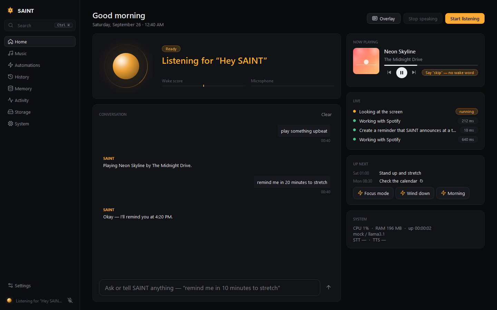
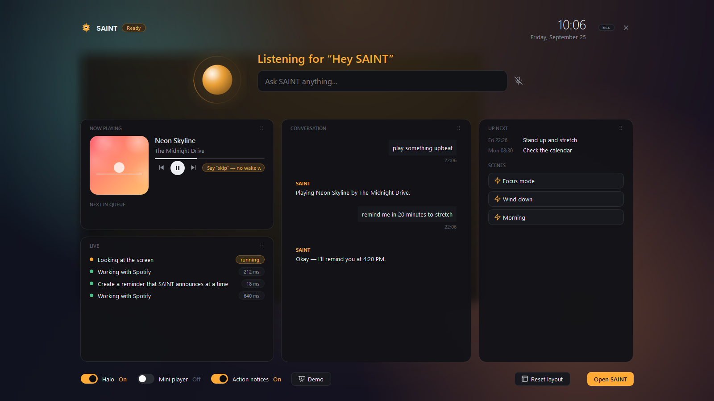
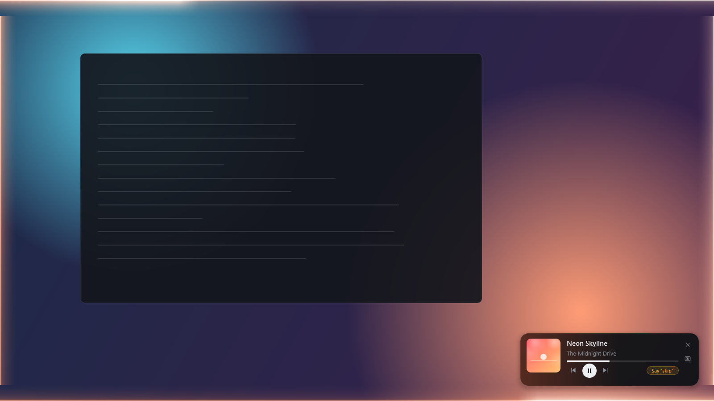
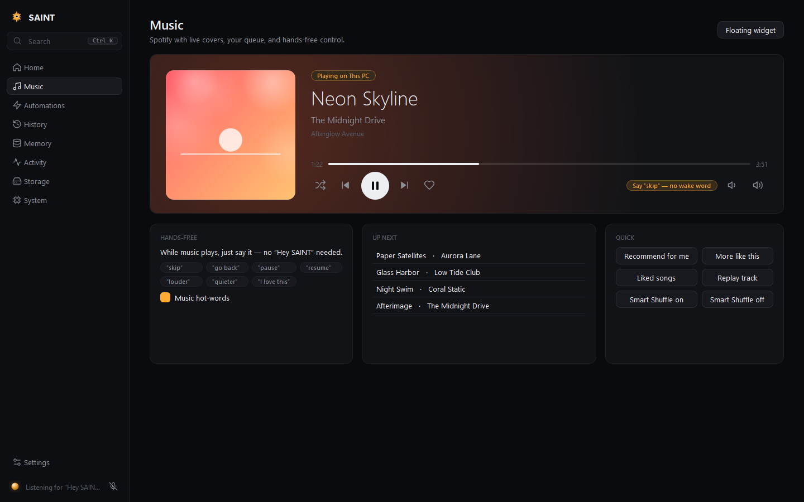
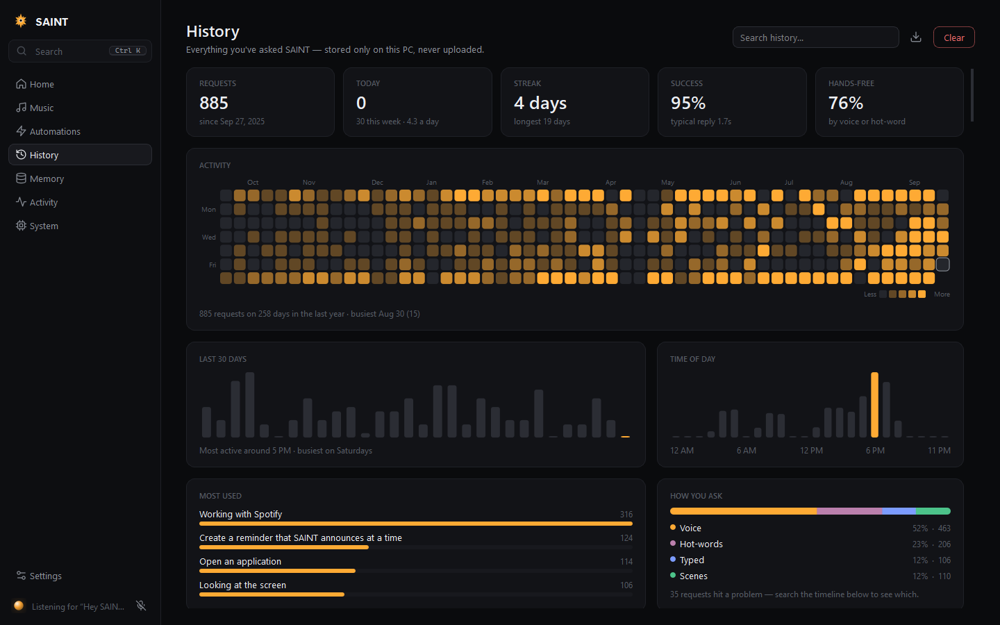
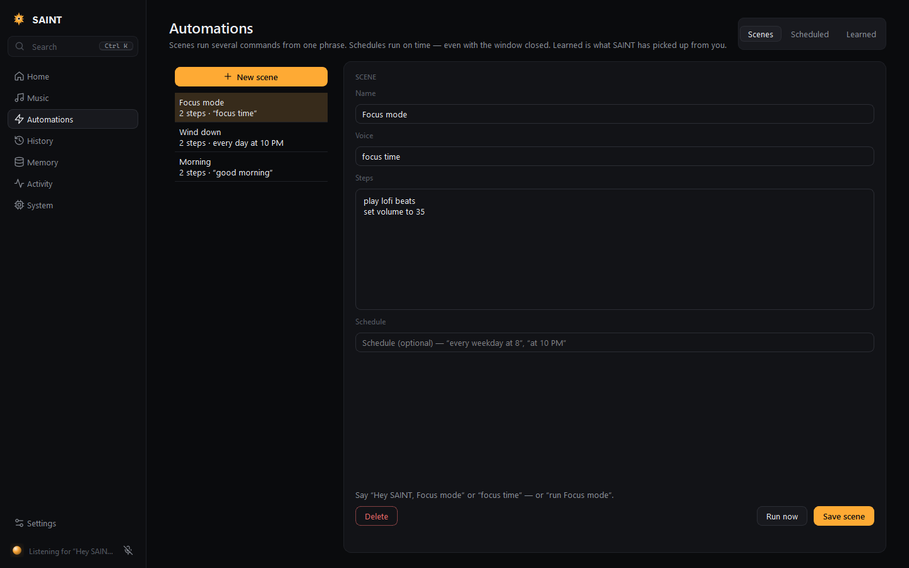
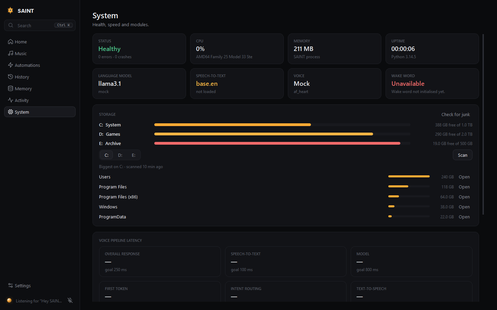
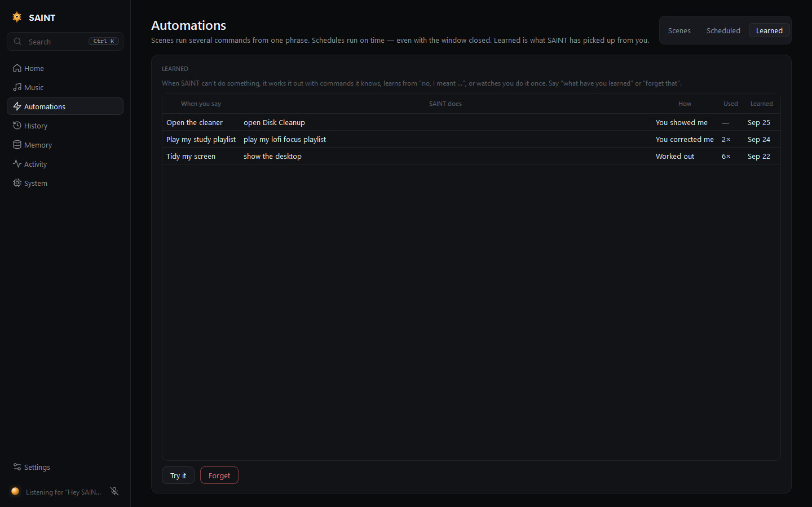
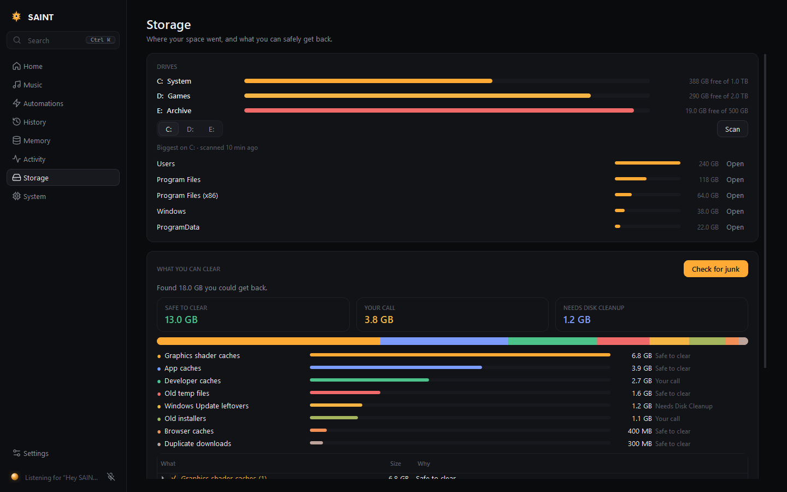
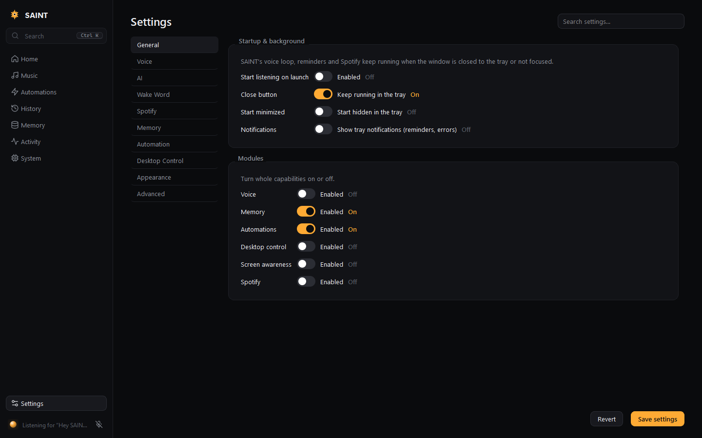

<p align="center"></p>

<h1 align="center">SAINT</h1>

<p align="center"><b>A local, voice-first AI assistant for Windows.</b><br>
Say “Hey SAINT” — it listens, does the real thing, and answers out loud. Everything runs on your PC.</p>

<p align="center">
  <a href="#installation">Install</a> ·
  <a href="#the-interface">Tour</a> ·
  <a href="#talking-to-saint">What you can say</a> ·
  <a href="#privacy-and-security">Privacy</a>
</p>



SAINT waits locally for its wake word, understands your request, remembers what you've told it, picks
the right tool, performs the real action and answers out loud — then goes back to listening. It
controls Spotify (with a personal listening memory), keeps long-term memory about you, runs reminders,
scheduled commands and multi-step scenes, and automates your desktop (apps, windows, keyboard, mouse,
UI elements). The language model runs locally through [Ollama](https://ollama.com).

## Highlights

- **Voice first.** A custom “Hey SAINT” wake model, GPU speech recognition, natural speech output,
  and interruptions that just work. After it answers, follow-ups need no wake word.
- **The Halo.** When SAINT is minimized, a soft light travels around the edge of your monitor —
  slow while it waits, bright and fast while it listens (breathing with your voice), twin comets while
  it thinks, and tinted by your album cover while music plays. It never blocks a click.
- **The overlay.** Press <kbd>Alt</kbd>+<kbd>`</kbd> anywhere — or rest your cursor at the top-centre edge of
  the screen — for a Steam-style overlay over whatever you're doing: ask anything, see what's playing,
  the conversation, what SAINT is doing, what's next, and your scenes.
- **Music, hands-free.** A floating always-on-top mini player with real album covers. While music plays,
  just say **“skip”**, **“pause”**, **“go back”**, **“louder”** — no wake word.
- **Scenes.** One phrase, many actions: “focus mode” → play lofi, set volume, open Notion. Run them by
  voice, from the overlay, or on a schedule.
- **Your whole PC, by voice.** Launch Steam games, find what's filling your drives and clear it safely,
  extract downloads with WinRAR, lock the PC, mute your mic, set Discord to 30 %, switch to your
  headphones, save and restore window layouts, and "tell me when Claude finishes".
- **History.** Everything you've asked and what SAINT did — a year of activity as day squares, streaks and
  usage charts — stored only on your PC.
- **Command palette.** <kbd>Ctrl</kbd>+<kbd>K</kbd> jumps to any page, runs scenes and actions, or asks
  SAINT directly.
- **Private by design.** Wake word, speech, voice and language model are all local. Nothing about you
  is uploaded.

## What's new in this version

**2.1 — Gaming Mode you control, multi-monitor, tasks that continue, and a real Windows app:**

- **SAINT.exe and an installer.** `python packaging/windows/build.py` builds `build/windows/SAINT/SAINT.exe`
  (no Python or terminal needed; speech models bundled, works offline) and `build/windows/SAINT-Setup.exe`
  (per-user install, Start menu and optional desktop shortcut, clean uninstall; your settings and memory in
  `%LOCALAPPDATA%\SAINT` are kept).
- **Gaming Mode is a switch, not a side effect.** A game running no longer means Gaming Mode — turn it on by
  voice ("gaming mode on"), from the tray or in Settings → Gaming Mode, or switch on *Auto Gaming Mode*.
  Each part of SAINT has its own Gaming Mode setting: wake word, spoken replies, mini player, Spotify,
  notifications (all / minimal / off), vision, screen automation, Halo, AI chat, performance mode, and
  moving SAINT off the game's monitor. Anti-cheat safety (no see-through overlay on a game, no clicks into
  it) applies to any running game.
- **Multi-monitor.** While gaming, SAINT's window, overlay and mini player go to a monitor without the game
  (or the one you pick). "Move the mini player to my second monitor", "put SAINT on the left screen".
- **Mini player.** Shows what SAINT is doing (listening, thinking, the task step) and Gaming Mode. Right-click
  for keep-on-top, opacity, size and monitor; drag its right edge to resize; ctrl+scroll to fade; it remembers
  a separate position for Gaming Mode.
- **Tasks that continue.** Multi-step requests are remembered step by step (even across a restart):
  "where were we?", "continue what we were doing", "finish it", "do the same thing for Discord",
  "set up my gaming workspace".
- **Startup you can see.** Settings → System → *Startup* lists every subsystem (voice, speech output, AI model,
  Spotify, Link, monitors…) with why it failed and a **Retry** button; one failing part never stops SAINT.

**Earlier — Game Mode, Better Listening & Dialog State:**

**Latest — Game Mode, Better Listening & Dialog State:**

- **Game Mode:** SAINT automatically detects fullscreen and protected games. It hides overlays (like the Halo), pauses screen hashing, and prevents input injection so it stays out of your game's way and avoids anti-cheat flags. Settings restore when the game exits.
- **Short-Answer & Dialog Fixes:** A new dialog state machine fixes the dropped "yes/no" answers. SAINT now listens better for single-word replies during follow-ups, with shortened end-of-speech waits and clear countdown indicators when waiting for your choice.
- **Improved Follow-ups:** Follow-up commands automatically strip filler words ("uh", "yeah"), and you can reference items naturally (like "the second song" for Spotify results).
- **Better Demonstrations:** The demonstration recorder now filters out unrelated windows and asks you to review steps before saving them.
- **Packaging Groundwork:** Path resolution, frozen-app support, AppUserModelID, and multi-size taskbar icons are now built-in, laying the foundation for an upcoming standalone EXE installer.
- **UI & LLM Polish:** Added a "Didn't catch that" visual cue for dropped speech, LLM argument repairs, and output guards to prevent raw tool-syntax from being spoken out loud.

**Earlier — SAINT remembers what just happened:**

- **Short-term memory.** SAINT keeps track of what it did, made or found in the last half hour — the
  screenshot it took, the folder it extracted, what a junk check found, the app it opened, the playlist it
  played. So you can follow up naturally: "delete that screenshot", "open that folder", "move it to my C:
  games folder", "rename it to TheLoop", "copy the path", "what did you find?", "delete it", "the other old
  installers too", "go to my most recent download and delete it". Removing or moving anything still asks
  first, and only ever uses the Recycle Bin. The language model is given the same list as facts, so it
  answers "what did you find?" from what really happened instead of guessing a path.
- **Corrections that name only the thing.** "I meant my moe playlist", "I said Claude" (after "switch to
  Glod"), "no, the folder you just made" — SAINT fits the right thing into your last request. Spelled
  letters work too: "…spelled M-O-E". A correction also answers an open "Did you mean …?" question.
- **Files by voice.** "Make a new folder in my games folder called The Loop", "move it to the D drive",
  "rename it", "show it in Explorer", "open the screenshot". Spoken places like "my C: games folder" or
  "games/the loop" resolve to real folders.
- **Storage page.** A new sidebar page: drive space, what's using it, and **What you can clear** — a chart
  by category (graphics shader caches, Spotify/Discord caches, browser caches, old temp files, crash dumps,
  developer caches, duplicate downloads, old installers, Windows Update leftovers, what's already in the
  Recycle Bin) and a list you tick. The junk check now looks in far more places.
- **Learning you can edit.** Automations → Learned has an editor: change what a phrase does, or add your
  own ("gaming time" → open Steam, open Discord). By voice: "save that as game time" right after something
  worked, or "make a shortcut called gaming time that opens Steam and Discord". "Switch back", "delete it"
  and other pointing phrases are never saved as recipes.
- **Watching asks first.** After something fails SAINT asks "Want to show me?" — only "yes" starts watching,
  so it no longer records the wrong thing at the wrong time. More ways to say it ("watch me do it", "I'm
  going to do it now, watch"), more ways to finish ("I'm all done"), and it notices windows moved to
  another screen or maximized. Programs it sees you start that it couldn't find by name (taskbar-only apps
  like Bloxstrap) are added to its app list; things an app starts by itself aren't recorded as steps.
- **Fixes from the 2026-09-25 evening log.** Spotify no longer needs reconnecting at every launch (a test
  had been wiping the saved login; a Spotify hiccup no longer forgets it either). Scrolling really scrolls
  (it was moving 1/20 of a wheel notch) and "scroll more" / "keep scrolling" go further each time.
  One-word answers ("Yeah.") and short commands ("Press enter.") aren't dropped as low-confidence speech.
  "Delete …" never means "forget a memory". "The loop layer" isn't YouTube's loop. "Close that window"
  names the window it means. The planner can't click things you never named or press Delete on its own.
  Opening the Steam library when Steam is closed waits for Steam, then opens it. Apps pinned only to the
  taskbar or the desktop are found by name ("open Bloxstrap", "block strap").

**Earlier — SAINT learns what it can't do yet:**

- **It tries harder.** When a request isn't one SAINT knows ("hop over to Discord", "open disk, clean up")
  or what it tried fails ("I couldn't find a window for all my windows"), the local model rewrites the
  request as commands SAINT *does* know ("switch to discord"; "show the desktop" then "double click the
  recycle bin"). Every step is checked before anything runs, so the model only ever picks real,
  permission-checked commands. If it works, SAINT remembers: next time it's instant.
- **"No, I meant …" teaches it.** "Play my gym playlist" → "no, I meant play my moe playlist" plays moe
  *and* remembers that's what "my gym playlist" means. "No, close the finals" answers a question and does
  it.
- **Show it once.** If SAINT still can't work it out, it offers to watch (a pill shows "Watching how you
  do it"). Do it yourself, say "done", and SAINT turns what you did into steps it can repeat — apps you
  opened, buttons and icons you clicked (by name), shortcuts you pressed. It never records what you type.
  "Let me show you how to …" starts a lesson any time.
- **Automations → Learned** lists everything learned, how (worked out, corrected, shown) and how often it's
  used, with *Try it* and *Forget*. By voice: "what have you learned", "forget that".
- **Fixes from the 2026-09-25 log.** Video audio and room conversation no longer become requests (the
  follow-up check now covers the window after an action and talking over SAINT). "Minimize all my
  windows", "right click the desktop on my main screen", "double left click", "the recycling bin" (the
  desktop icon, not text on screen), "close the finals" / "close to area" (finds the game by its Steam
  folder or a misheard name and asks with the real name; offers a force quit if it won't close), "take a
  screenshot of Claude", "turn down Spotify", "open YouTube and fullscreen it", "my gym playlist" never
  silently becomes a stranger's playlist, "never play that playlist again", a repeated request isn't
  dropped as a loop, and the model can't ban artists or record dislikes from a chat reply anymore.
- **Voicemeeter.** "Mute" / "unmute" / "mute my mic" mute Voicemeeter's mic strip; "switch my audio to my
  headphones" / "use my speakers" move Voicemeeter's A-bus routing (A2 speakers ↔ A1 headset).
- **Progress you can see.** Scans and junk checks fill a ring on the action pill; "what are you doing?"
  says how far along they are.

**Earlier — hands-free PC control:**

- **SAINT controls itself.** "Open the dashboard", "go to history", "turn off the mini player", "hide the
  halo", "dark mode", "minimize yourself". "The mini player" means SAINT's; YouTube's only when YouTube is
  named or being watched.
- **Steam.** "Launch Counter-Strike 2", "start cs2", "play Terraria on Steam", "open my Steam library",
  "search Steam for Hades", "what games do I have", "what are my biggest games", "uninstall Celeste" (asks
  first, and Steam asks again). SAINT reads Steam's own files, including libraries Steam has forgotten
  about, and tells you how to add them back.
- **Files and storage.** "How much space is left on E", "what's taking up space on D", "clean up my
  Downloads", "what can I delete on E", "only the installers", "find my emulators", "open my games
  folder". Duplicate downloads, archives you've already extracted, temp files, shader caches and old
  recordings are found for you. Games, emulators, ROMs and Steam libraries are never suggested. Anything
  removed goes to the Recycle Bin **after you say yes** — SAINT never deletes permanently and refuses
  anything the Recycle Bin couldn't hold. The Storage page has every drive, a scan and
  the biggest folders.
- **WinRAR.** "Go to my Downloads folder, click the first download and extract it using WinRAR to my games
  folder" is one action: the newest archive, into its own folder, with a free-space check, progress, no
  overwriting, and "delete it afterwards" if you ask. "Compress this folder as a rar."
- **Windows.** "Lock my PC", "restart" / "shut down" (asks, then waits 60 s — "cancel the shutdown"), "mute
  my mic", "set Discord to 30 percent", "mute the game", "switch audio to my headphones", "brightness 60",
  "take a screenshot".
- **Stop, silent mode, whispering.** "Stop" / "cancel" / "stop everything" interrupt speech, multi-step
  plans, scenes and typing mid-way. "Be quiet for 30 minutes" keeps SAINT working without talking (it
  still asks questions and reports errors). Whisper a request and SAINT answers quietly. "What are you
  doing?" describes the plan in progress.
- **Watching.** "Tell me when Claude finishes", "tell me when this download finishes", "tell me when Steam
  closes", then "take me back". "What changed while I was away?" "Watch my left screen" makes "click",
  "read this" and "what's on screen" use that monitor.
- **Workspaces and scenes.** "Save this workspace as Coding" / "restore Coding" reopens and places every
  window on the right monitor and resumes your music. New starter scenes: *Gaming mode* ("let's game"),
  *Done gaming* ("I'm done gaming") and *Dev environment*.
- **Clipboard, notifications, developer mode.** "Read my clipboard" (never secrets), "summarize / translate
  what I copied", "fix the code I copied" (the fix goes back on the clipboard). "Read my notifications",
  "only tell me about important notifications", "always tell me about Discord". "Run the tests", "open the
  file causing the error". "Handle this" proposes one step for the window in front and asks first.
- **Personal aliases.** "When I say the lab, I mean open my SAINT project in VS Code."
- **Spotify learns from what you actually skip.** Skips in the Spotify app are caught within seconds
  (through Windows' media controls) and recorded once — voice skips used to be counted twice. Paused time
  isn't "listening". Your Spotify top tracks, saved songs and recently played feed the picks. **DJ mode:**
  "more energetic", "something darker", "more like the last song", "something I haven't heard", "no more
  of this artist".
- **History.** A GitHub-style year of day squares, current and longest streak, success rate, typical reply
  time, time of day, busiest weekday and how you ask (voice, hot-words, typed, scenes).
- **Fixes from the logs.** "Moved Otis" now says "Moved Spotify" (and YouTube instead of Opera). "Press F to
  full screen", "one time speed", "go to my browser on my right screen", "clear everything off the screen
  but YouTube", "go to Astral Games" (a link on the page) all work. SAINT uses the browser window you used
  last instead of asking "which one?". Follow-ups without the wake word ignore chatter like "OK? Why
  not?", and Whisper's "No, no, no, no…" loops are dropped. The `llama3` model-missing warning is gone
  (your setting is updated to `llama3.1`).

**Previous update:**

- **Rearrange the overlay.** Drag any card in the <kbd>Alt</kbd>+<kbd>`</kbd> overlay by its title bar to
  move it, or drag an edge or corner to resize it. The layout is remembered; *Reset layout* puts it back.
- **Action notices.** A small pill at the bottom of the screen shows what SAINT is doing ("YouTube · 1.5x
  speed", "Search YouTube for lofi") and whether it worked. Click-through, never steals focus.
- **Switches you can read.** Every on/off setting is now a switch with a plain *On* / *Off*. The Halo,
  action notices and the mini player apply the moment you flip them — and show themselves (the Halo glows
  for a few seconds, even over the overlay; a sample notice pops up), so you can tell without leaving
  the menu. All three are also switches in the overlay.
- **YouTube, the way you'd use it.** "Theater mode", "full screen", "1.5x speed", "normal speed",
  "skip ahead 30 seconds", "captions on", "next video", "next chapter", "mute", "jump to 50 percent",
  "set the quality to 1080p", "turn off autoplay", "loop this video", "sleep timer 30 minutes",
  "skip the ad", "like this video"… SAINT uses YouTube's own keyboard shortcuts, and its player menus for
  the settings that have none. While a YouTube tab is in front, bare commands ("pause", "faster",
  "mute") mean the video.
- **The mini player shows anything that's playing** — a YouTube video, VLC, a browser tab, not just
  Spotify — with its artwork, progress and working controls (through Windows' media controls).
- **No more "which browser?" every time.** One browser window on your screen: SAINT just uses it.
  Several: it asks once and keeps using the one you picked until that window closes ("use a different
  browser" to change it). None on screen: it offers the minimized ones or a new window; no browser at
  all: it offers to open yours.
- **Memory that learns, and a profile of you.** Besides what you tell it outright, SAINT now picks up
  things you mention in passing ("I'm a nurse", "I hate horror movies", "my sister's name is Mia") and,
  optionally, lets the local model find lasting facts in what you say. Learned facts are marked as such,
  get stronger when they come up again and fade if they never do; a guess never overwrites something you
  said. The Memory page opens with your profile: who you are, likes, dislikes, people, projects,
  routines, music taste and usage habits, plus a short summary written from those facts.

A ground-up rewrite of the interface:

- New minimal design system: near-black surfaces, hairline borders, one accent, a monoline icon set,
  and motion everywhere it helps (page transitions, a sliding nav pill, a living state orb, cross-fading
  covers, toasts). One switch in Settings turns all animation off.
- **Halo**, **overlay** (global hotkey + edge tab), **floating mini player**, **music hot-words**,
  **scenes**, **History** with usage stats, **command palette**, and a merged **System** page (health,
  latency, modules).
- **Demo mode** — SAINT drives its own UI for 30 seconds (wake word, a request, music, a hands-free
  skip, the palette and the overlay). It's fully scripted: nothing real runs, nothing is written to your
  history. Start it from the palette, the overlay or the tray; <kbd>Esc</kbd> stops it.
- Sharp album art everywhere (SAINT now uses Spotify's 640 px cover), loaded off the UI thread.
- **Fixes from live testing:** follow-ups without the wake word now work while music plays (anything
  SAINT recognises as a command is kept; chatter and lyrics are ignored), one-word commands ("pause",
  "skip") are no longer dropped for low speech-recognition confidence, a long request said with
  pauses arrives as one command, run-on multi-step requests ("open my browser search YouTube for …")
  are split correctly, "find the settings button" / "the X button in the top right" / "the recycle bin"
  find the right element (including on the taskbar and desktop), new commands ("hide everything except
  Spotify", "open a new tab", "summarize this page", "open my Monkeytype browser"), news questions answered
  from the Google News feed, and the overlay shows your Spotify queue.

| | |
|---|---|
|  |  |
| **Overlay** — over whatever you're doing | **Halo** — light around the screen edge, plus the mini player |
|  |  |
| **Music** — cover-tinted player, hands-free words, queue | **History** — a year of activity, streaks and timeline |
|  |  |
| **Scenes** — one phrase, many actions | **System** — health, storage, latency, modules |
|  |  |
| **Learned** — what SAINT worked out, was corrected on, or was shown | |

<sub>Screenshots are generated by `tools/dev/screenshots.py` from synthetic demo data (fictional tracks
with generated covers) — no personal data.</sub>

---

## Contents

- [Highlights](#highlights)
- [What works today](#what-works-today)
- [Architecture](#architecture)
- [Requirements](#requirements)
- [Installation](#installation)
- [Running SAINT](#running-saint)
- [Talking to SAINT](#talking-to-saint)
- [Wake word](#wake-word)
- [Speech recognition (STT) and speech output (TTS)](#speech-recognition-stt-and-speech-output-tts)
- [Interrupting SAINT](#interrupting-saint)
- [AI provider / Ollama](#ai-provider--ollama)
- [Spotify](#spotify)
- [Memory](#memory)
- [Reminders and automations](#reminders-and-automations)
- [Desktop control and permissions](#desktop-control-and-permissions)
- [Screen awareness](#screen-awareness)
- [Your PC, hands-free](#your-pc-hands-free)
- [Languages](#languages)
- [SAINT Link](#saint-link)
- [Learning](#learning)
- [The interface](#the-interface)
- [Configuration](#configuration)
- [Logging and debugging](#logging-and-debugging)
- [Tests](#tests)
- [Troubleshooting](#troubleshooting)
- [Project layout](#project-layout)
- [Privacy and security](#privacy-and-security)

---

## What works today

Everything below was verified on the development machine: Windows 11, RTX 5060 Ti, Python 3.14,
Ollama 0.34 with `llama3.1`. The check combined the automated tests with a live end-to-end run of the
real runtime (wake model, faster-whisper, agent, Ollama, Kokoro TTS, scheduler and desktop tools).
That live run fed synthesized speech into SAINT's voice loop in place of the microphone.

| Area | Status |
|---|---|
| Wake word "Hey SAINT" and "SAINT" | ✅ Two stages: the local ONNX model (CPU, ~1 ms per 80 ms frame) plus a transcript check for short utterances the model misses (it barely scores a bare "SAINT"). On synthetic speech from 4 voices, clean and with music at −8 dB, 64/64 wake decisions were correct, with no false wakes on "paint", "She is a saint" or plain commands. Background speech is never acted on or shown. |
| Conversation mode (no wake word for follow-ups) | ✅ After SAINT answers, follow-ups such as "skip that" or "turn it down" work for 15 s (configurable), counted from when SAINT stops talking. While music plays, only follow-ups SAINT recognises as commands (or short questions to it) are taken, so lyrics and chatter are ignored. Verified live. |
| Wake → command → STT → agent → tool → TTS → back to wake listening | ✅ |
| Interrupting SAINT while it talks (barge-in) | ✅ Your speech interrupts it and SAINT's own voice doesn't. The interrupting request is then processed. |
| Memory ("my favorite language is Python" → later "what language do I like?") | ✅ Persists across restarts. You can view, edit and delete memories. |
| Reminders, timers, recurring reminders, scheduled commands | ✅ Persist across restarts, run in the background and can be cancelled. Reminders missed while SAINT was closed are delivered on start-up. |
| Desktop control: open/reuse/close apps, move/resize/snap windows across monitors, type, keys, click/double/right-click/hover UI elements, scroll | ✅ All through validated tools. Verified live on two monitors (see [the manual test checklist](docs/MANUAL_TESTING.md)). Existing windows are reused, and SAINT asks which one if several match. |
| Multi-step requests ("open my browser, search YouTube for X, click the first video and pause") | ✅ Planned, then executed step by step with observe → act → verify, one retry and a clarifying question when needed. Verified live. |
| LLM function calling for requests the command router doesn't recognise | ✅ With tool-capable Ollama models (`llama3.1`, `llama3.2`). |
| Spotify: search, play track/artist/album/playlist/genre, pause/resume/skip/back, volume, queue, add to playlist, listening memory, recommendations | ✅ Covered by tests against a simulated Spotify API. ⚠️ Not yet run against a live account on this machine (see [Spotify](#spotify)). |
| Screen understanding ("what's on my second screen?", "what am I looking at?", "what is this error?") | ✅ From Windows APIs + UI Automation: monitors, windows per monitor, focus, buttons, links, fields, tabs, visible text. Image-level description additionally needs a vision-capable Ollama model (none is bundled). |
| Halo, overlay (global hotkey + edge tab), mini player, demo mode | ✅ Verified live with the real runtime. The Halo costs ~0.1–0.3 % CPU while animating. |
| Music hot-words ("skip", "pause", "louder" with no wake word while music plays) | ✅ Tested end-to-end through the voice loop with synthetic audio. ⚠️ One-word hot-words were fixed after a live run (Whisper scores single words near zero confidence) and need a live re-check. |
| Scenes (voice phrase, "run …", UI, schedule) and History | ✅ Covered by automated tests. |
| Steam: installed games, sizes, library/store, launch | ✅ Game list and sizes verified live against this PC's libraries. ⚠️ Launching and uninstalling by voice need a live check. |
| Drive space, biggest folders, junk report, Storage page | ✅ Verified live, read-only (a 500 GB drive with 1.9 M files scans in under a minute). ⚠️ Recycling and moving are covered by tests with a simulated Windows file operation; try them on a test folder first. |
| WinRAR extraction and compression | ✅ Verified with the installed WinRAR against test archives. |
| Windows controls (lock, power, mic, per-app volume, output device, brightness) | ✅ Audio devices and sessions read live. ⚠️ Changing them by voice needs a live check. |
| Stop / silent mode / whisper replies / "what are you doing?" | ✅ Covered by tests. ⚠️ Whisper loudness needs a live check. |
| Watchers, "what changed?", workspaces, notifications, clipboard | ✅ Covered by tests; the notification list was read live on this PC. ⚠️ Restoring a workspace across monitors needs a live check. |

### Known limitations

- **Bare "SAINT" relies on the transcript check.** The bundled `hey_saint.onnx` detects **"Hey SAINT"**
  well but barely scores a bare "SAINT" (≤ 0.02). A short utterance the model misses is transcribed
  once and accepted only if it *starts* with "SAINT" / "Hey SAINT". This costs one quick STT pass per
  short passive utterance, and none for speech longer than 7 s. Retraining with more bare-word
  samples would make the first stage catch it too (see [Retraining](#retraining)).
- **Wake-word accuracy on real voices** was measured on synthetic voices and background speech in
  the room. Tune it in Settings → Wake Word. A very low threshold (≈ 0.05) makes a bare "SAINT"
  reliable but can fire mid-sentence; SAINT keeps the rest of the request as one command either way.
- **Barge-in is energy based, not full acoustic echo cancellation.** With headphones it's excellent.
  With loud speakers right next to the microphone, raise *Echo margin* (Settings → Voice) if SAINT
  interrupts itself, or lower it if interrupting is too hard.
- **Smart Shuffle** isn't in Spotify's Web API. SAINT toggles it through the Spotify desktop app's own
  button (UI Automation) and falls back to regular shuffle when the app isn't open. **Removing songs
  from the queue** isn't possible through the API at all, and SAINT says so.
- **Spotify genre data** is no longer returned to new apps, so "something like X" uses the artist,
  their collaborators and your own listening history.
- **Notifications** are read from Windows' own notification list (read-only), because Windows reserves its
  notification-listener API for Store apps. A future Windows update could change that file's layout.
- **Do Not Disturb** has no API for regular apps: SAINT opens its settings. **Brightness** works on laptop
  screens; most desktop monitors don't let Windows change it.
- **An old Windows installation on a second drive** (like `E:\Windows` + `E:\Users`) is far too big for
  the Recycle Bin, so SAINT only reports it. Copy what you need from its `Users` folder, then format the
  drive yourself in Disk Management.
- **Steam libraries Steam doesn't list** (e.g. after reinstalling Windows) are shown, but their games can't
  be launched until you add the folder in Steam → Settings → Storage.
- **Workspaces** put programs and windows back, not browser tabs or open files.
- **Web pages** are read through the browser's accessibility tree. Pages that don't expose their
  content (canvas apps, some games) can't be clicked by name; use coordinates or a vision model.

---

## Architecture

```
MICROPHONE (sounddevice, 30 ms frames)
   │
   ├─ VAD: Silero (speech vs. music/TV, from faster-whisper) with an RMS fallback
   ├─ Wake word, stage 1: onnxruntime (CPU) melspectrogram → embeddings → hey_saint.onnx
   │      fires when N of the last W frames clear the threshold (or one frame is very confident)
   └─ Wake word, stage 2: a short utterance the model missed is transcribed once and accepted
          only if it *starts* with "SAINT" / "Hey SAINT" (otherwise dropped; nothing is shown or logged)
          ▼
   WAKE_DETECTED → COMMAND_LISTENING   ("Hey SAINT, play jazz" and "SAINT … play jazz" both work)
          ▼
   STT: faster-whisper (GPU) → transcript with the wake phrase stripped
          ▼
   CONVERSATION MANAGER ──► after SAINT answers: conversation window (no wake word needed)
          ▼
   AGENT
     1. pending question?  (yes/no confirmations, "which window?" choices)
     2. reminders / memory
     3. multi-step plan  → OBSERVE → ACT → VERIFY → (retry once / ask) → next step
     4. single intents: system · Spotify · desktop/screen/browser (desktop_intents) · legacy desktop
     5. otherwise the LLM (Ollama) with memories, the real clock and tool calling
          ▼
   TOOL REGISTRY  (typed parameters, validation, permission policy, confirmation, events, logs)
     spotify.* · memory.* · automation.* · desktop.* · screen.* · browser (open_url / web_search)
          ▼
   RESULT + VERIFICATION (window moved? page changed? track changed?)
          ▼
   OUTPUT GUARD (modules/agent/output.py): no JSON, tool names, schemas, code or unbacked
   "I did X" claims ever reach the chat or TTS
          ▼
   RESPONSE → TTS (Kokoro, GPU) → conversation window → back to WAKE_LISTENING
```

Key ideas:

- **One authoritative state.** `core/assistant_state.py` holds `WAKE_LISTENING`,
  `WAKE_DETECTED`, `COMMAND_LISTENING`, `PROCESSING`, `EXECUTING`, `SPEAKING`, `OFFLINE` and `ERROR`.
  The voice loop, conversation controller and tool registry drive it; the UI only renders it.
- **Independent of the UI.** `core/runtime.py` starts TTS, the conversation controller, the
  wake-word listener and the scheduler. Core services receive events directly on the emitting thread
  (`event_bus.subscribe`); only UI widgets receive them through Qt. SAINT keeps working when the
  window is minimised, hidden to the tray or not focused.
- **No pretending.** Actions go through explicit tools, and SAINT's reply is built from the tool's
  actual result. Failures are reported plainly (e.g. "Spotify isn't connected"). The LLM is told the
  real time and only the memories you stored.
- **No shell for the LLM.** Shell and file tools exist for the owner but are never offered to the
  model. High-risk tools require confirmation.

---

## Requirements

- **Windows 10/11** (desktop control uses Win32 and UI Automation).
- **Python 3.12+** (developed and tested on 3.14).
- **Ollama** for the language model (optional, but SAINT can only chat with a model).
- **NVIDIA GPU recommended.** STT and TTS fall back to the CPU, at lower speed. The RTX 50-series
  (Blackwell) needs the CUDA 12.8 PyTorch wheels.
- A microphone and speakers or headphones.

---

## Installation

```bat
git clone https://github.com/uberdiz/SAINT.git
cd SAINT
setup.bat
```

`setup.bat` creates `.venv` and installs the CUDA PyTorch build when it finds an NVIDIA GPU. It then
installs `requirements.txt`, pulls `llama3.1` into Ollama (if Ollama is installed) and runs the tests.

Manual install:

```bat
python -m venv .venv
.venv\Scripts\activate
pip install --index-url https://download.pytorch.org/whl/cu128 torch torchaudio   & rem GPU; omit the index URL for CPU
pip install -r requirements.txt
ollama pull llama3.1
```

Models downloaded on first use: the faster-whisper STT model (e.g. `base.en`, ~150 MB) and the
Kokoro TTS model and voices (~330 MB, from Hugging Face). The wake-word models ship with the repo in
`data/wake/`.

---

## Building SAINT.exe and the installer

```bat
.venv\Scripts\pip install pyinstaller
winget install JRSoftware.InnoSetup
.venv\Scripts\python packaging\windows\build.py
```

- `build\windows\SAINT\SAINT.exe` — double-click to run (keep it with its `_internal` and `models` folders).
- `build\windows\SAINT-Setup.exe` — installs to `%LOCALAPPDATA%\Programs\SAINT`, no admin rights needed.
- The packaged app keeps its data in `%LOCALAPPDATA%\SAINT` (set `SAINT_DATA_DIR` to use another folder,
  e.g. your source checkout's `data`). With the CUDA build of PyTorch the folder is about 5 GB.

---

## Running SAINT

```bat
run.bat                 & rem or: .venv\Scripts\python app.py
run.bat --background    & rem start hidden in the system tray
```

- SAINT starts listening for **"Hey SAINT"** straight away (turn this off in Settings → General).
- Closing the window keeps SAINT running in the **system tray** — the Halo around your screen shows
  it's still listening, and <kbd>Alt</kbd>+<kbd>`</kbd> opens the overlay. Right-click the tray icon to
  start/stop listening, toggle the Halo or mini player, run the demo, or quit.
- Only one instance runs at a time.

---

## Talking to SAINT

Say **"Hey SAINT"** or **"SAINT"**, then your request, in one breath or after a short pause. After
the wake word SAINT plays a soft chime and waits up to 6 seconds for the command. **After it answers,
just keep talking**: for 15 seconds (Settings → Wake Word → *Conversation window*) follow-ups like
"skip that", "turn it down" or "now put it on the left" need no wake word. While music is playing,
SAINT only takes follow-ups it recognises as commands (or short questions to it), so song lyrics and
people talking don't trigger anything; say "Hey SAINT" first for anything else, even mid-conversation.
Long requests can be said with natural pauses between the steps. You can also type into the
Home page, the overlay or the command palette; typed text goes through exactly the same agent.

**Music hot-words.** While Spotify is playing (or paused with the mini player on screen), a short
playback command on its own works with **no wake word at all**: "skip", "skip this song", "next song",
"go back", "pause", "resume", "louder", "quieter", "turn it up", "I love this". The whole utterance must
be one of these, so lyrics and conversation around you are ignored. It rides on the wake word's existing
transcript check, so it costs nothing extra. Turn it off in Settings → Spotify → *Hands-free*.

References carry over: "it", "that", "that window", "there" and "the first one" mean the thing SAINT
just worked with, unless you've switched to another window since. "Turn it down" means Spotify after
a music command and the computer volume after a video. With several matching windows SAINT asks
("I found 3 browser windows: 1, … Which one?"). Answer "the second one", "the YouTube one" or "the one
on my second screen".

| You say | What happens |
|---|---|
| "Hey SAINT, play Blinding Lights by The Weeknd" | Resolves the actual track on Spotify and plays it |
| "…play Daft Punk" / "…play the album Discovery" / "…play my gym playlist" / "…play some jazz" | Artist / album / your playlist / genre playlist |
| "…pause" · "resume" · "skip" · "go back" · "turn it up" · "set the volume to 30" | Playback control |
| "…play something else" · "play a different song" · "change the song" · "I'm not feeling this one" | Skips (the last also records a dislike). Never treated as a song title. |
| "…play something like DAMN by Kendrick Lamar" · "play something by Kendrick Lamar" | Picks similar music from that album/track/artist · plays that artist |
| "…turn on Smart Shuffle" · "replay this song" · "skip ahead 30 seconds" · "who is this?" | Smart Shuffle (via the Spotify app), restart, seek, current artist |
| "…what am I listening to?" · "what have I listened to today?" | Live playback state · SAINT's listening memory |
| "…play something I'd like" · "play something similar" · "recommend something similar" | Personalised picks from your real listening history |
| "…add this to my chill playlist" · "queue Harder Better Faster Stronger" | Real playlist/queue changes |
| "…my favorite programming language is Python" | Stored in long-term memory |
| "I'm a software engineer" · "I hate horror movies" · "my sister's name is Mia" (in passing) | Learned quietly for your profile (Settings → Memory) |
| "…what programming language do I like?" | Answered from memory ("Your favorite programming language is Python.") |
| "…forget my favorite programming language" · "what do you know about me?" | Delete / list memories |
| "…remind me at 5 PM to work on AIDE" · "remind me in 30 minutes" · "set a timer for 10 minutes" | One-time reminders |
| "…every morning remind me to check my schedule" · "remind me every weekday at 8:30 to stand up" | Recurring reminders |
| "…every weekday at 9 play my focus playlist" | Scheduled command |
| "…what reminders do I have?" · "cancel the stretch reminder" | Manage automations |
| "…focus mode" · "run wind down" · "start the morning scene" | Runs a [scene](#scenes) you made |
| "skip" · "pause" · "louder" (music playing, no wake word) | Music hot-words |
| "…open Discord" · "switch to Spotify" · "close Notepad" (asks first) | Apps and windows |
| "…move this window to my second monitor" · "snap Chrome to the left" · "maximize this window" | Window placement |
| "…type hello world into the search box" · "press ctrl+t" · "click the send button" | Keyboard and UI elements |
| "…open my browser" · "open YouTube" · "search YouTube for Kendrick Lamar" | Uses the browser on your screen (asks once if several, then remembers) · site search |
| "…use a different browser" · "use this browser from now on" | Change which browser window SAINT uses |
| "…theater mode" · "1.5x speed" · "skip ahead 30 seconds" · "captions on" · "next video" · "set the quality to 1080p" · "turn off autoplay" · "loop this video" · "skip the ad" | YouTube's own shortcuts and player menus |
| "…click the first video" · "in that window, click the first result" · "click the button in the bottom right" | Finds visible results/elements (UI Automation) and verifies the page changed |
| "…scroll down" · "go back" · "refresh" · "copy that" · "put it in fullscreen" · "double click the recycle bin" | Scrolling, navigation, editing keys, element actions |
| "…move the browser to my second monitor" · "make it bigger" · "put it on the left" · "put this window next to Spotify" · "close all the browser windows" | Window management (closing asks first) |
| "…open my browser, search YouTube for Kendrick Lamar, click the first video, and turn the volume down" | Multi-step plan, each step verified |
| "…what's on my second screen?" · "what am I looking at?" · "what's currently open?" · "what is this error?" | Screen understanding per monitor. "Error" answers only from text actually on screen. |
| "…open the dashboard" · "go to history" · "turn off the mini player" · "hide the halo" · "dark mode" | SAINT's own window |
| "…launch Counter-Strike 2" · "open my Steam library and search Hades" · "what are my biggest games?" | Steam |
| "…how much space is left on E?" · "what's taking up space on D?" · "clean up my Downloads" · "only the installers" | Storage (removing always asks; Recycle Bin only) |
| "…go to my Downloads, click the first download and extract it using WinRAR to my games folder" | One extraction, newest archive → its own folder |
| "…lock my PC" · "mute my mic" · "set Discord to 30 percent" · "switch audio to my headphones" · "restart" (asks) | Windows controls |
| "…tell me when Claude finishes" · "take me back" · "what changed while I was away?" · "watch my left screen" | Watching |
| "…save this workspace as Coding" · "restore Coding" · "gaming mode" · "I'm done gaming" | Workspaces and scenes |
| "…read my clipboard" · "fix the code I copied" · "read my notifications" · "run the tests" · "handle this" | Clipboard, notifications, developer mode |
| "…more energetic" · "something darker" · "more like the last song" · "no more of this artist" | Spotify DJ mode |
| "…when I say the lab, I mean open my SAINT project" · "be quiet for 30 minutes" · "what are you doing?" | Aliases, silent mode, status |
| "…stop" · "cancel" · "stop everything" | Stops speaking, the running plan or scene, and typing (everything also stops background work) |

Anything else goes to the language model, which can also call the same tools.

---

## Wake word

- Model: `data/wake/hey_saint.onnx`, your custom openWakeWord classifier trained on "hey saint" and
  "saint", with near-miss negatives such as "faint", "paint" and "saved".
- Runtime: `modules/voice/wake_word.py` runs openWakeWord's three-stage pipeline (mel-spectrogram →
  speech embedding → classifier) **directly on onnxruntime**. Its scores match the reference
  openWakeWord implementation to within 0.0003. SAINT does not import the `openwakeword` package,
  because it pulls in scikit-learn, which Windows Application Control blocked on the development
  machine.
- **Stage 1 (model):** fires when *confirmation frames* (default 1) of the last *detection window*
  frames (default 4 × 80 ms) score ≥ *threshold* (default 0.50), or one frame is very confident, outside
  a *cooldown* (default 2 s). Strictly consecutive frames (the old rule) missed clear "Hey SAINT"s that
  peaked for a single frame. On 50 synthetic near-miss phrases ("paint", "sent", "Hey Sam", "She is a
  saint", …) nothing fired at thresholds down to 0.2.
- **Stage 2 (transcript check):** a short passive utterance (≤ 7 s) the model didn't fire on is
  transcribed once. It's accepted only if it starts with "SAINT" / "Hey SAINT". "SAINT, <pause> skip
  this" is judged as one utterance, and very short clips are padded so Whisper doesn't hallucinate on
  them. Bystander speech is never shown, acted on or logged.
- **Music:** the Silero VAD separates speech from music (0 % of loud synthetic music counted as speech,
  vs 62 % with the old energy VAD), so commands end cleanly while music plays. Utterances are capped
  at 15 s.
- While SAINT itself is speaking, wake detections are ignored so it can't wake itself. Interrupting is
  handled by barge-in (below), and the conversation window only starts counting once SAINT stops
  talking.
- If the model file is missing or invalid, Home and Settings show the exact error. SAINT
  then falls back to transcript-gated listening; nothing is faked.

Settings → **Wake Word**: enable/disable, model file, sensitivity, confirmation frames, detection
window, transcript check (and its length limit), cooldown, command timeout, conversation window,
follow-up confidence, chime, score logging, and a live score meter. Settings → **Voice**: speech
detector (Silero/RMS), longest utterance.

### Retraining

`hey_saint.onnx` was trained locally with
[Open-Wake-Word-Training](https://github.com/DisasterofPuppets/Open-Wake-Word-Training) (a Windows
wrapper around openWakeWord and Piper), using the config in `tools/wake_word/hey_saint.yaml`. To
improve bare-"SAINT" detection, increase the weight or number of `saint` samples and retrain:

1. Use Python 3.12 (`uv venv --seed --python 3.12`) and replace `webrtcvad` with `webrtcvad-wheels`.
2. Build in a **short path** such as `C:\oww`; torch's CUDA headers exceed Windows' 260-character limit.
3. `python install.py --gpu`, then download the training assets (~16 GB).
4. Delete stray `README.txt` files inside the augmentation asset folders.
5. Train: `python openWakeWord/openwakeword/train.py --training_config config/hey_saint.yaml --generate_clips --augment_clips --train_model`.
6. The model is `training/hey_saint.onnx`; the TFLite conversion step afterwards fails, which is
   harmless. If a `hey_saint.onnx.data` file is produced next to it, merge it into one file:
   ```python
   import onnx
   m = onnx.load("training/hey_saint.onnx", load_external_data=True)
   onnx.save_model(m, "hey_saint.onnx", save_as_external_data=False)
   ```
7. Copy the result to `data/wake/hey_saint.onnx`, or point Settings → Wake Word at it.

---

## Speech recognition (STT) and speech output (TTS)

- **STT:** [faster-whisper](https://github.com/SYSTRAN/faster-whisper), `base.en` by default,
  float16 on CUDA. It only runs on speech captured after the wake word (or on every utterance when
  the wake word is off). SAINT biases it toward spelling "SAINT" correctly (`voice.stt_hotwords`).
  Typical latency here: 90–215 ms per command. Settings → Voice: model, device, precision, language.
- **TTS:** [Kokoro](https://github.com/hexgrad/kokoro), voice `af_heart`, on CUDA with CPU
  fallback. Out-of-dictionary words (names, bands) use the bundled espeak-ng fallback. Qwen3-TTS is
  available as an alternative engine.
- Device selection and CUDA diagnostics are centralised in `core/device.py` and logged at start-up.

---

## Interrupting SAINT

The microphone is **never muted** while SAINT speaks:

1. The TTS playback thread reports the level of every audio block it plays (`core/audio_echo.py`).
2. The voice loop compares microphone energy against the echo predicted from that level, using a
   continuously learned speaker-to-mic coupling. Only speech clearly above the predicted echo,
   sustained for about 240 ms, counts as you talking.
3. On barge-in SAINT stops speaking at once and captures what you're saying, including the start of
   the utterance. The request is then handled as an interruption, so the model knows its last answer
   was cut off.
4. A second, text-level echo filter drops transcripts that simply repeat SAINT's own words.

You can also say "stop" or "never mind", or press **Stop speaking**. Tune this in Settings → Voice →
Interruptions.

---

## AI provider / Ollama

1. Install [Ollama](https://ollama.com) and run `ollama pull llama3.1`. `llama3.2` also supports
   tool calling; `llama3.2:1b` is faster but weaker.
2. Settings → **AI**: provider `ollama`, model, base URL (`http://localhost:11434`). Use **Test
   connection** and **Refresh list** to check.

If the configured model isn't installed, SAINT uses the closest installed one and says so. If Ollama
isn't running, SAINT answers "I can't reach my language model right now…" and never makes up a
reply. An OpenAI-compatible endpoint also works (provider `openai`, with base URL and API key), but
tool calling is currently implemented for Ollama.

---

## Spotify

SAINT talks to the Spotify Web API through your own developer app.

1. Create an app at <https://developer.spotify.com/dashboard>.
2. Add the redirect URI **`http://127.0.0.1:8888/callback`** (or the one shown in Settings).
3. Settings → **Spotify**: enable Spotify, paste the **Client ID**, press **Connect Spotify** and log
   in through the browser. SAINT uses Authorization Code + PKCE, so no client secret is needed. Tokens
   are stored in the **Windows Credential Manager** (`keyring`), never in files or logs.
4. Playback control requires **Spotify Premium** (a Spotify API rule).

What SAINT does:

- **Resolves real entities.** It searches tracks, artists, albums and playlists, and picks the best
  match with fuzzy scoring. "X by Y" means a track; "my … playlist" searches your playlists first;
  "some jazz" finds a genre playlist.
- **Recovers when no device is active.** It activates your preferred or most recent device, or opens
  the Spotify desktop app and waits for it.
- **Keeps a listening memory** (`data/memory/spotify_memory.db`): tracks actually observed playing
  (a background poller every 15 s), what you asked for, what you skipped and how far in, songs added
  to playlists, and whether you kept or skipped its recommendations. Artist genres are cached for
  genre-level taste.
- **Personalised picks** ("play something I'd like") are ranked from that memory and your Spotify top
  artists, excluding recently played and skipped tracks. With no history yet, SAINT says so instead
  of guessing. Spotify retired its `/recommendations` endpoint for new apps, so SAINT builds
  candidates from search.

Status: the Spotify layer is covered by automated tests against a simulated API, including device
recovery, skips and honest failures. On the development machine no Spotify account was connected, so
live playback wasn't exercised. Connect your account in Settings to use it.

---

## Memory

| Kind | Where | What |
|---|---|---|
| Short-term | RAM (`modules/ai/context.py`) | The current conversation (last N turns). Not persisted. |
| Long-term | `data/memory/saint_memory.db` | Facts you tell SAINT, stored as key/value (`favorite programming language = Python`), with categories *preference*, *personal*, *fact* and *project*. Saying something again updates it; the old value is kept in its history. |
| Spotify | `data/memory/spotify_memory.db` | Listening history, requests, skips, feedback, playlist aliases, genres. |
| Automations | `data/memory/automations.db` | Reminders and scheduled commands. |
| Scenes | `data/scenes.json` | Your scenes. |
| History | `data/history.jsonl` | What you asked, how (voice, typed, hot-word, scene), SAINT's reply, tools used and timings. Powers the History page. Local only; turn it off or cap its size in Settings → Memory, clear or export it on the History page. |

Memories come from two places:

- **Told** — clear statements ("my favorite X is Y", "call me Sam", "I live in…", "remember that…").
  Kept until you delete them.
- **Learned** — things you mention in passing ("I'm a nurse", "I'm learning Japanese", "I hate horror
  movies"), and — with *Learn with the AI* on — lasting facts the local model finds in what you say
  (it runs after SAINT has answered, on your PC). Learned memories carry a confidence, grow stronger
  each time they come up again, and fade after *Forget unconfirmed after* (60 days by default) if they
  never do. A learned guess never overwrites something you told SAINT. *Keep it* on the Memory page
  makes one permanent.

SAINT does not store every conversation. Answers such as "Your favorite programming language is Python"
come straight from the database. The LLM gets the few core facts about you plus the memories relevant
to the request, and is told not to invent others.

The **Memory** page opens with your **profile**: name and what you do, likes, dislikes, people and pets,
projects and goals, routines, music taste (from Spotify's listening memory) and habits (when and how you
use SAINT, the sites and apps you ask for — from the local history), with a short summary the local
model writes from exactly those facts (cached in `data/memory/profile.json`). Below it, every memory
with how SAINT knows it; add, edit, delete, or confirm. By voice: "what do you know about me?", "forget
my …". Settings → Memory controls learning, context injection and wiping.

---

## Reminders and automations

- **Time expressions:** "at 5 PM", "at 17:30", "at noon", "in 30 minutes", "in an hour and a half",
  "twenty minutes from now", "tomorrow at 9", "tonight", "on Friday", "every morning", "every weekday
  at 8:30", "every Monday and Thursday at 7 PM", "every 2 hours", "set a timer for 10 minutes".
- **Reminders** are spoken (TTS) and shown as a tray notification.
- **Scheduled commands** run any command through the agent at the set time, with the same tools and
  permissions, e.g. "every weekday at 9 play my focus playlist". Optional condition: "…if Spotify is
  playing" or "…is not playing".
- **Persistence:** the SQLite store survives restarts. One-time reminders missed while SAINT was
  closed are delivered on start-up if they're within *missed_grace_hours* (default 12); recurring
  ones resume on schedule.
- **Management:** Automations → **Scheduled** (create with a live preview of how the time was
  understood; pause, resume, run now, cancel, delete) or by voice.

### Scenes

A scene is a name, an optional extra voice phrase, and a list of commands run in order — anything you
could say to SAINT (“play lofi beats”, “set volume to 35”, “open notion”). Create them in Automations →
**Scenes** (templates included), then trigger them by saying the name or phrase (“Hey SAINT, focus
mode”, “run wind down”), from the overlay, Home or the command palette, or on a schedule (“every
weekday at 8”). Scenes are stored in `data/scenes.json`; a scheduled scene is an ordinary scheduled
command that says “run <name>”, so it survives restarts like any other automation.

---

## Desktop control and permissions

Every desktop action is an explicit tool with validated inputs:

| Tool | Notes |
|---|---|
| `desktop.open_app` | **Reuses a running app's window** instead of launching a duplicate. With several windows it picks the one the request, your focus or the conversation points at, else asks. "Browser" means the running or default browser; "a new window" really opens one. Resolved only against what's installed. Launched without a shell. |
| `desktop.close_app` / `desktop.close_windows` | Graceful `WM_CLOSE`, then the title-bar close command. **Asks for confirmation** by default (always for "close all …"). Reports honestly if the app stays open (e.g. a save prompt). |
| `desktop.scale_window`, `desktop.place_beside` | "Make it bigger", "put this next to Spotify". Results are measured afterwards. |
| `desktop.open_url`, `desktop.web_search` | Navigate / search sites (YouTube, Google, Amazon, …) in your existing browser window. Verified by the page title changing. |
| `desktop.focus_window`, `desktop.move_window`, `desktop.arrange_window`, `desktop.resize_window` | Switch, move to monitor N/next/left/right, maximise/minimise/snap/centre. |
| `desktop.type_text` | Unicode typing via SendInput, optionally into a named field ("search box") found through UI Automation. Length-limited. |
| `desktop.press_keys` | Key names are validated; Alt+F4, Win+L, Ctrl+Alt+Del, Win+R and Win+X are refused. |
| `desktop.click_element` / `desktop.list_ui_elements` | Real UI elements from the Windows accessibility tree, by label, position ("button in the bottom right") or order ("first video": visible results only, sidebar and off-screen carousel items skipped). Click, double, right, middle and hover. Reports whether the UI changed. |
| `desktop.mouse_move` / `desktop.mouse_click` / `desktop.drag` / `desktop.scroll` | Coordinates checked against the virtual screen. Scrolling moves the pointer over the intended window first. |

Commands act on the window SAINT is working with, unless you've switched to another window since.
They never act on SAINT's own window when you typed into it. Keyboard input only goes to a window
that was verified to be in front. The process is per-monitor DPI aware, so coordinates stay exact
with mixed display scaling.

Safety:

- **Permission mode** (Settings → Automation): *Safe* (low-risk only), *Confirm* (default: high-risk
  actions ask first) or *Autonomous*. Per-tool overrides (allow/confirm/deny) are in Settings →
  Desktop Control.
- **Switches** for app launching, window control, keyboard and mouse.
- The LLM never gets `run_command`, `write_file` or background shell tasks.
- pyautogui's fail-safe stays on: move the mouse into a screen corner to abort mouse automation.

---

## Screen awareness

| Stage | Status |
|---|---|
| Screen capture (`screen.capture`, all monitors or one) | ✅ |
| Window / monitor / focus context | ✅ |
| UI element understanding: buttons, fields and links of the active window (Windows UI Automation) | ✅ |
| Visual analysis of the image | ⚠️ Only with a vision-capable Ollama model (Settings → Advanced → Vision, e.g. `llama3.2-vision`). Otherwise SAINT says it's not configured. |
| Action planning → mouse/keyboard | ✅ Through the desktop tools. The LLM can combine `screen.context` with `desktop.*`. |

`screen.context` covers every monitor: which is the main one, where each sits, resolution and
scaling, and the windows on it, front-most first. For the window you're looking at, or the front
window of the monitor you asked about, it lists buttons, links, fields, menus, tabs and visible
text. It runs on demand only; nothing is captured in the background. "What's on my screen?", "What's
on my second screen?" and "What's currently open?" answer from this. Image analysis is added when a
vision model is configured, and is told to say when it can't tell rather than guess. Settings →
Vision → *Screen reading* turns it off.

---

## Your PC, hands-free

Everything here also works typed, and every destructive action asks first. Nothing is ever deleted
permanently: removals go to the Recycle Bin, and SAINT checks the Recycle Bin can hold each item first.

**SAINT itself** — "open the dashboard", "go to history / settings / music", "turn off the mini player",
"hide the halo" / "halo always on", "open the overlay", "turn off action notices", "dark mode",
"minimize yourself".

**Steam** — reads `libraryfolders.vdf` and each `appmanifest_*.acf`, plus `steam.extra_libraries`
(default `D:\SteamLibrary`). Launching uses `steam://rungameid/…`, so Steam does the work.

**Files and storage** (`modules/files`) — drive overview, background scans (cached for
`files.scan_cache_hours`), a junk report, and cleanup that asks before anything moves. "My games folder" is
`files.games_dir` (default `D:\Games` — set it in Settings); name more folders in `files.known`. Never touched: Windows, Program
Files, ProgramData, drive roots, your profile folder itself, code repositories and SAINT. Never suggested:
Steam libraries, your games folder, emulators and ROMs.

**Archives** — `.rar` through WinRAR's `UnRAR.exe` (with progress), `.zip` through WinRAR or Python,
`.7z` through `WinRAR.exe`. The archive goes into its own folder unless it's already wrapped in one.

**Windows** — lock, sleep, restart, shut down (asks; restart and shutdown wait 60 s), mic mute, per-app and
whole-PC volume, output device, brightness, screenshots of everything, one screen or one window
(Pictures\Screenshots). Audio uses `pycaw`. With **Voicemeeter** running (`audio.voicemeeter.enabled`:
auto), "mute my mic" mutes its microphone strip (`mic_strip`, -1 = find it) and "switch audio to my
headphones" moves every strip from the speakers' A-bus to the headset's. Bare "mute" means the mic
(`audio.bare_mute`: mic / system).

**Stop and silence** — "stop", "cancel", "shut up" stop what's happening now; "stop everything" also stops
background scans, extraction and watchers. "Silent mode" / "be quiet for 30 minutes" / "you can talk again".
Quiet requests get quiet answers — "quiet" compared with how loud you usually talk to SAINT
(Settings: `voice.whisper_replies`, `whisper_rms`, `whisper_ratio`, `whisper_gain`).

**Watching** (`modules/watch`) — up to five watches at a time, each ending after two hours. "Finished"
means the window changed and then stayed still for 8 seconds (a reply finished streaming, a build
finished). "What changed?" compares window titles and tiny per-screen fingerprints kept in memory for 30
minutes.

**Workspaces** — `data/workspaces.json`: each window's program, monitor, position and state, plus the
Spotify context. **Scenes** *Gaming mode*, *Done gaming* and *Dev environment* are added once; edit or
delete them on the Automations page.

**Notifications** — off until you say "read my notifications out loud" (or enable the module). Then new
notifications that match `notifications.keywords`, or come from an app in `notifications.allow`, are
announced; apps in `notifications.deny` never are. "Read my notifications" works any time.

**Aliases** — "when I say X, I mean Y" (`data/aliases.json`); "what aliases do I have", "forget the alias X".

**Storage page** — drive space and the biggest folders on top; below, **What you can clear**: *Check for
junk* looks through Downloads (duplicates, archives you've already extracted, old installers, big downloads
untouched for months), temp files older than `files.temp_age_days`, graphics shader caches, browser caches
(Chrome, Edge, Brave, Opera, Firefox), Discord / Spotify / VS Code caches, crash dumps, developer caches
(pip, uv, npm, Yarn — shown, never pre-ticked), old game recordings, Windows Update leftovers and old
Windows installs, plus what's already in the Recycle Bin. A stacked bar and a per-category chart show where
the space is; the list below is ticked for what's safe. *Move ticked to Recycle Bin* asks once more, then
uses Windows' own Recycle Bin (never a permanent delete). Checks started by voice show up here too.

**Short-term memory** (`modules/agent/recent.py`) — every tool result and finished background task leaves
a note for 30 minutes: a screenshot taken, a folder extracted, made, moved or renamed, a junk check's
findings, an app opened, a playlist played. "It" / "that" on their own only reach back 5 minutes; a named
reference ("that screenshot", "the folder you just extracted") reaches the full 30. Removing ("delete it")
only ever points at something SAINT made or found — never at a folder it merely opened — and still asks.
The same notes go to the language model as facts, so it doesn't invent results. Nothing is saved to disk.

---

## Languages

`modules/lang` — SAINT understands Spanish, French, Portuguese, German and Italian as well as English, answers in the language you spoke, and copes with sentences that mix two ("pon some jazz", "recuérdame to call mom at 5").

- **Per-word detection.** Each word votes for the languages it belongs to; words that several languages share ("no", "la", "a") go to whichever language the clearer words point at; names, titles and numbers don't vote at all (a capitalised word in mid-sentence is a name). A sentence is *mixed* when a second language has a real share of the votes. A one-word answer ("ok") keeps the language of the conversation for `language.sticky_minutes`.
- **Commands.** Only the *shape* of a command is translated, into the canonical English the router already understands; what you named is copied exactly as you said it. `"pon música de Bad Bunny"` → `play Bad Bunny`; `"recuérdame llamar a mamá a las 5 de la tarde"` → `remind me at 5 pm to llamar a mamá`. Times and durations in any pack's language ("a las cinco y media", "um 17 Uhr", "às 5 da tarde") become the English time phrases `modules/automation/timeparse.py` reads.
- **Replies.** SAINT's English replies go back through the language's phrasebook, sentence by sentence, with titles and names passed through untouched. What the phrasebook can't say is translated by your local model (`language.llm_translate`), so there is always an answer. Mixed requests are answered in the same mix (`language.mixed_mode: "mirror"`), or in your main language (`"dominant"`).
- **Speech.** Kokoro speaks each language with its own voice, and a sentence that mixes two is split into stretches that each get the right voice. For recognition, turn on `language.multilingual_stt` (Whisper then auto-detects the language; it uses `voice.stt_model_multilingual`), and the wake phrase also works as "hola SAINT", "salut SAINT", and so on.
- **Adding or fixing a language.** The packs are plain JSON in `modules/lang/lexicon/` (vocabulary, command patterns, time phrases, the reply phrasebook). The same files are used by the iPhone app, and `tests/data/lang_cases.json` is checked by both the Python and the Swift tests.

```json
"language": {
  "auto_detect": true, "reply_in_user_language": true, "preferred": ["es", "en"],
  "mixed_mode": "mirror", "llm_translate": true, "sticky_minutes": 10, "multilingual_stt": false
}
```

---

## SAINT Link

`modules/link` — connect SAINT to your **phone**, your **other PCs**, and **friends' SAINTs** over `IP:port`, on the same network or any network where they can reach each other (a VPN or Tailscale works). **Off by default** — turn it on in *Devices*, or set `link.enabled`.

### Two kinds of device

| | **My device** (`own`) | **Collaborator** (a friend's SAINT) |
|---|---|---|
| Learned things (memories, skills, aliases, scenes, reminders, language settings) | synced both ways, automatically | never synced; you can *share* one thing, and the receiver decides whether to keep it |
| What you're doing right now | shared, so "what did I just ask?" works on whichever device you're using (memory only, 30 minutes) | not shared |
| Talk to its SAINT / control it | yes | no — only the closed list of automations below |
| Files | yes | yes (executables are saved as `.unsafe`) |

**Automations a collaborator can run on your PC** (each is `allow` / `ask` / `deny` per person, edited in *Devices → the person → Permissions*; "ask" waits for your yes, by voice or button):
`send_prompt` (type a prompt into Claude, ChatGPT, Gemini, Copilot, Perplexity or Grok), `message` (SAINT reads it out), `open_url` (http/https only), `run_scene` (only scenes you shared), `play_music`, `ask` (a plain answer, not your tools). Nothing else is reachable: a friend cannot run arbitrary commands, read your files or use your PC's tools.

### Voice

- *"pair my phone"*, *"add Gian as a friend"* — opens a pairing window and shows a QR code and a code.
- *"send this prompt to Gian's PC on Claude: summarise my notes"* · *"send a message to Gian: dinner is ready"* · *"play lofi on Gian's PC"* · *"open https://… on Gian's PC"*
- *"ask my laptop to lock itself"* · *"ask Gian's SAINT what the capital of Peru is"*
- *"send that to Gian"* (the file Explorer has selected) · *"accept what Gian shared"* · *"share this scene with Gian"*
- *"what devices are connected?"* · *"sync my devices"* · *"unpair Gian"*

The common ones work in the languages above too ("manda este prompt al PC de Gian en Claude: …").

### Pairing and security

- **Pairing** uses a one-time 128-bit code (the QR code holds it), valid for five minutes and for one device; ten wrong tries close the window. It is the pre-shared key of a Noise `XXpsk3` handshake, so someone on your Wi-Fi who never saw the code cannot pair, and the code itself is never sent.
- **After pairing**, each device remembers the other's public key and reconnects with Noise `IK`: mutual authentication, forward secrecy, ChaCha20-Poly1305. A device that isn't in your list gets nothing and is counted as a failed probe. Device ids are the first 16 hex digits of the SHA-256 of the key, so an id can't be claimed without the key.
- **Implementation.** `Noise_IK_25519_ChaChaPoly_SHA256` and `Noise_XXpsk3_25519_ChaChaPoly_SHA256` (Noise revision 34), written with the standard library so it runs where compiled packages are blocked by Application Control (it uses `cryptography` automatically when installed). It is cross-checked byte for byte against the `noiseprotocol` package, and the known-answer vectors in `tests/data/link_vectors.json` are checked by the iPhone app's tests too.
- **A paired phone is you.** Your own devices can control this PC, so keep your phone locked, and unpair it from *Devices* if you lose it. For friends, start from the defaults (they can message you and send files; most everything else asks, or is off) and open up per person.
- **Discovery** is mDNS (`_saint._tcp`, via `zeroconf`) plus a small UDP beacon on port 8766. Both only *advertise* an address; they carry no trust. Paired devices dial each other by the last address they saw, or you can type `IP:port`.
- **Firewall.** Windows asks once to allow Python on private networks. The default port is 8765 (`link.port`).

### Configuration

```json
"link": {
  "enabled": false, "port": 8765, "bind": "0.0.0.0", "device_name": "", "discoverable": true,
  "auto_connect": true, "sync_interval_sec": 60, "share_context": true, "announce": true,
  "approval_timeout_sec": 60, "max_file_mb": 1024, "max_prompt_chars": 2000, "inbox_dir": "",
  "prompt_targets": {}, "shared_scenes": []
}
```

`link.prompt_targets` adds apps for "send this prompt to … on `<app>`": `{"notion": {"app": "Notion", "url": "https://www.notion.so", "wait": 4.0}}`. `link.shared_scenes` lists the scenes collaborators may run. Received files are in `data/link/inbox/<device>/`.

### The iPhone app

The iPhone app (SwiftUI) is in [`mobile/`](mobile/README.md): always listening for "SAINT", the same language layer, reminders, Spotify, and control of this PC from the phone. It dials *out* to this PC, so nothing on the phone listens for connections. [`mobile/docs/IPHONE_SETUP.md`](mobile/docs/IPHONE_SETUP.md) explains how to get it onto a phone, including from Windows without a Mac.

---

## Learning

`modules/learning` — SAINT getting better at *your* requests without anyone writing a new command.

```
request ─► learned skill? ─► run its steps
        └► router ─► ok ─► done
                  └► not known / "couldn't find…" ─► planner (local model)
                                                    ├─ steps SAINT understands? ─► run, verify ─► learn
                                                    └─ no plan ─► "want to show me?" ─► yes ─► watch
"no, I meant X" ─► run X ─► learn it for the request before
```

* **Planner** (`planner.py`) — the model sees the command shapes in `catalog.py` (every one is tested to
  route), the open windows, and what SAINT already learned, and answers with JSON steps. A step is only
  run if the router understands it and it's grounded in what you said (no "this window" unless you said
  it, no typing you didn't dictate, the monitor you named, no "…but YouTube" you never mentioned). Steps go
  through the normal router, permission checks and confirmations. It may only click something that
  sounds like what you said, and only press keys if you asked it to press something.
* **Skills** (`skills.py`, `data/skills.json`) — request → commands, learned three ways (worked out,
  corrected, shown). Matched before the router so a learned fix beats the old guess; close speech-to-text
  variants match too. A skill that fails three times in a row is dropped (unless you wrote or edited it).
  Requests that point at something ("switch back", "delete it", "open that folder") are never learned. Edit
  or add skills on **Automations → Learned**, or say "save that as …" / "make a shortcut called … that …".
* **Corrections** (`corrections.py`) — "no, I meant …", "I meant for you to …", "that's not what I asked
  for, …" within 2½ minutes of a request. A correction that names only the thing ("I meant my moe
  playlist", "I said Claude") is fitted into the last request: the same kind of thing is swapped, or the
  word that sounds most like it, or the same action is done on it. Letters spelled out ("M-O-E") are joined.
* **Watch and learn** (`demonstration.py`) — polls the mouse buttons, keyboard *shortcuts* and the window
  list while a lesson runs (up to 2 minutes, ends 15 s after your last action or when you say "done").
  Clicks are named with Windows' accessibility info; Start-menu and taskbar clicks that only opened an app
  become "open X". A program another program started by itself isn't a step; windows moved to another
  screen, maximized or minimized are. Programs SAINT couldn't find by name are added to `desktop.apps` with
  the .exe that ran. Plain typing is never recorded, only that it happened. Nothing is kept but the
  commands. After a failure SAINT only *offers* to watch; "yes" starts it.
* Settings: `learning.planner`, `planner_timeout_sec`, `watch_and_learn`, `watch_after_failure`,
  `watch_max_sec`, `watch_idle_sec`.

---

## The interface

Everything you see is driven by real events from the core runtime — the UI never guesses what SAINT is
doing.

| Page | What it shows |
|---|---|
| **Home** | The state orb (colour, breathing, rings and ripples follow the real assistant state and your voice), wake-word status with live score and mic meters, the conversation with typed input, now playing, a **Live** feed of tools as they run, what's up next, one-click scenes, and system stats. |
| **Music** | A cover-tinted now-playing hero (sharp album art, live progress, shuffle / previous / play / next / like / volume), the hands-free words, your queue and quick actions. |
| **Automations** | **Scenes** (editor with templates, voice phrase, steps, optional schedule, run now) and **Scheduled** reminders and commands. |
| **History** | Totals, today, last 7 days, how much you use SAINT hands-free, a 30-day chart, your most-used tools and a searchable, filterable timeline. Export or clear it. |
| **Memory** | Your profile (who you are, likes, people, projects, routines, music and habits, with a written summary), then every memory — told or learned — to search, filter, add, edit, confirm or delete. |
| **Activity** | Every event, live, with filters (voice, agent & tools, Spotify, problems) and pause. |
| **System** | Health (status, CPU, memory, uptime, language model reachability, STT, voice, wake word), voice-pipeline latency against goals, and module status. |
| **Settings** | General · Voice · AI · Wake Word · Spotify · Memory · Automation · Desktop Control · Appearance · Advanced, with search. |

**Beyond the window**

| | |
|---|---|
| **Halo** | Light around the screen edge while SAINT is minimized (or always — Settings → Appearance → *Halo*; one or all monitors). Four thin click-through windows, so it never blocks anything. |
| **Edge tab** | Rest the cursor at the top-centre edge of the screen for a moment and a small SAINT tab slides down; click it for the overlay. |
| **Overlay** | <kbd>Alt</kbd>+<kbd>`</kbd> (configurable) from anywhere. A frosted copy of your screen with SAINT on top: state, input, now playing, live tools, conversation, up next, scenes, and toggles for the Halo, mini player and demo. <kbd>Esc</kbd> or a click on the background closes it. |
| **Mini player** | Floating, always on top, draggable (it remembers where you put it). Double-click it to open Music. It flashes when it hears a hot-word. |
| **Command palette** | <kbd>Ctrl</kbd>+<kbd>K</kbd>: pages, scenes, music controls, the Halo, the mini player, theme, demo — or “Ask SAINT: …”. <kbd>Ctrl</kbd>+<kbd>1</kbd>…<kbd>8</kbd> jump to pages. |
| **Tray** | Open SAINT, open the overlay, mini player, Halo, start/stop listening, demo, quit. |

**Appearance** settings: dark, light or system theme; accent colour (presets or custom); font and
size; compact density; animations on/off; window opacity; always on top; sidebar labels; Halo, edge tab
and overlay hotkey. Changes apply immediately. On Windows 11 the title bar follows the theme.



---

## Configuration

- Settings are saved to **`data/config.json`**. It's created on first run, migrated automatically
  when new options are added, and written atomically. `data/` is git-ignored.
- All paths are **relative to the SAINT folder**, so there are no machine-specific paths. Set
  `SAINT_DATA_DIR` to keep runtime data elsewhere (the tests do this).
- Most settings apply live when you press **Save settings**: the wake word reloads, the microphone
  restarts, TTS re-initialises, and the log level and appearance update.

Main sections: `voice.*` (mic, VAD, barge-in, STT, TTS, wake word, `music_hotwords`), `ai.*`,
`agent.*`, `memory.*`, `history.*`, `automation.*`, `desktop.*`, `spotify.*`, `vision.*`,
`appearance.*`, `overlay.*` (Halo mode, all screens, edge tab, hotkey), `widgets.*` (mini player),
`notifications.*`, `permissions.overrides`, `logging.*`.

---

## Logging and debugging

- Log file: `data/logs/saint.log` (rotating, 2 MB × 5), also printed to the terminal.
- Recorded: wake detections and scores, listening state changes, STT results and latency, the
  selected intent, tool start/finish/failure with duration, Spotify actions and errors, memory
  operations, automation creation/execution, desktop actions, TTS start/stop, barge-ins and
  interruptions, and all errors.
- High-frequency events (audio levels, tokens, per-chunk TTS timing, wake scores) are never logged
  per occurrence.
- Settings → Advanced: log level (Verbose / Normal / Errors Only) and **Debug mode**. Settings →
  Wake Word → *Debug* logs every wake score above 0.1.

---

## Tests

```bat
.venv\Scripts\python -m pytest
```

About 700 automated tests cover:

- wake-word model loading, silence and noise rejection, the windowed trigger and cooldown
- music hot-words (accepted only while music is active, whole-utterance match, confidence floor)
- the local history log (sources, tools, trimming, off switch) and scenes (voice matching, schedules)
- a headless build of the whole UI: every page, the command palette, overlay, Halo, mini player, and
  demo mode never reaching the core (no real actions, nothing in your history)
- the listening state machine (transcript wake for bare "SAINT", passive speech never acted on,
  wake → command, the conversation window that waits while SAINT talks, timeouts)
- natural-language intent understanding: many phrasings per action, action phrases never becoming
  song titles, context-dependent meaning ("turn it down", "go back", "pause") and multi-step plans
- which window a command acts on, and answering "which one?" questions
- the echo gate, plus interruption handling in the conversation controller
- intent routing for Spotify, memory, reminder and desktop phrasing
- memory store, recall, update and delete, including persistence across a restart
- the scheduler (parse, persist, execute, missed reminders, recurring, cancel)
- tool validation, permissions and confirmations, and desktop safety checks
- Spotify resolution, device recovery and listening memory against a simulated API, including skips
  counted once, paused time, skip sources and DJ mode
- SAINT's own window by voice, and every misrouted request from the live logs
- Steam file parsing and game matching; drive scans (junctions, cloud files), junk rules, WinRAR
  listing, zip-slip protection, and Recycle Bin / move safety against a simulated Windows file operation
  (a test fails if permanent deletion ever appears in `modules/files`)
- stop / silent mode / whisper replies, cancelling multi-step plans, aliases, the follow-up intent gate
- History streaks, heatmap levels and the never-trimmed daily summary
- Windows controls, clipboard (secret detection), workspaces, watchers with a fake clock, "what
  changed?", error-location parsing, "handle this" validation, notification parsing

Tests use a temporary data directory and mock STT, TTS and LLM backends, so they never touch your
settings, microphone, Spotify account or desktop. `tools/dev/` holds manual diagnostic scripts, and
`python tools/dev/screenshots.py` regenerates the README screenshots from synthetic data.

Before a release, run through the **[manual testing checklist](docs/MANUAL_TESTING.md)** (voice,
Spotify, screen, mouse/keyboard, windows, browser, multi-step, natural answers).

---

## Troubleshooting

| Problem | Fix |
|---|---|
| Mic meter flat / SAINT never hears you | Settings → Voice → Input device, then **Test (3 s)**. With Voicemeeter, make sure your microphone is actually routed to the bus SAINT listens on (e.g. "Voicemeeter Out B1"). |
| Wake word never triggers | Say "**Hey** SAINT". Raise the sensitivity and watch the live score in Settings → Wake Word. Check the status line for model errors. |
| Wake word triggers on TV or speech | Lower the sensitivity or add a confirmation frame. |
| "Wake word unavailable" | The status line gives the reason (missing model, missing feature models, onnxruntime not installed). |
| SAINT interrupts itself | Raise Settings → Voice → Echo margin, lower the speaker volume or use headphones. |
| "I can't reach my language model" | Start Ollama (`ollama serve`) and check the base URL. |
| "Model … isn't installed" | `ollama pull llama3.1`, or pick an installed model in Settings → AI. |
| TTS on CPU / "CUDA unavailable" | Install the CUDA PyTorch build (see Installation). The reason is logged at start-up. |
| Spotify: "isn't connected" / "no device" / "needs Premium" | Connect in Settings → Spotify. Open Spotify on a device. Playback control needs Premium. |
| "I can't see a 'search box'" | The app doesn't expose that element through UI Automation; click into the field and say "type …" instead. |
| DLL "blocked by Application Control" | A Windows Smart App Control / WDAC policy blocks a compiled package. SAINT avoids scikit-learn for this reason; allow the package or use a different Python environment. Smart App Control can also intermittently block SciPy DLLs that Kokoro TTS loads — System shows TTS as not ready; restart SAINT or turn Smart App Control off. |
| "Overlay hotkey is taken" toast | Another app already owns that shortcut. Pick a different one in Settings → Appearance → *Overlay hotkey* (e.g. `ctrl+alt+s`). |
| No Halo | It shows while SAINT is minimized or in the tray (or always — Settings → Appearance → *Halo*). Exclusive-fullscreen games draw over it; borderless-windowed games don't. |
| “Skip” without the wake word does nothing | Hot-words work while Spotify is playing (or paused with the mini player showing). Check Settings → Spotify → *Hands-free*. |

---

## Project layout

```
app.py                  entry point (Qt app, tray, single instance, runtime start)
core/
  runtime.py            starts/owns TTS, conversation controller, voice, scheduler (UI-independent)
  assistant_state.py    authoritative assistant state
  conversation.py       turn orchestration, TTS queue, interruption, announcements
  audio_echo.py         playback monitor + echo gate (barge-in)
  events.py             event bus (direct core subscribers + Qt signal for UI)
  config.py, paths.py   settings (+ migration) and project-relative paths
  permissions.py        allow / confirm / deny policy
  history.py            local usage log (data/history.jsonl) + never-trimmed daily summary
  history_stats.py      streaks, heatmap levels and totals for the History page
  cancel.py, activity.py  "stop" across plans/scenes/typing; "what are you doing?"
  ui_link.py            lets tools drive SAINT's window on the GUI thread
  logger.py, device.py, analytics.py, state.py, setup.py
modules/
  voice/                mic capture, VAD, wake word (ONNX), STT, TTS
  agent/                intent router, confirmations, LLM tool calling, short-term memory (recent.py)
  automation/           tool registry, scheduler, time parser, scenes, background tasks
  spotify/              OAuth PKCE, API client, tools, listening memory
  memory/               SQLite store + structured memory service
  desktop/              apps, windows, keyboard/mouse, UI Automation, clipboard, Windows/audio controls,
                        Voicemeeter, fuzzy window matching (misheard names, running Steam games)
  files/                drive scans, junk rules, Recycle Bin / move (undoable), WinRAR archives
  steam/                Steam library files, game matching, steam:// actions
  learning/             planner ("try harder"), learned skills, corrections, watch-and-learn
  watch/                watchers ("tell me when…") and the "what changed?" log
  workspace/            saved window layouts
  notifications/        Windows notifications (read-only)
  dev/                  run tests, open the file behind an error
  ui_control/           voice control of SAINT's own window
  vision/               screen capture, UI context, optional vision model
  ai/                   providers (Ollama/OpenAI-compatible/mock), context
ui/
  main_window.py        shell: sidebar, pages, tray, hotkey, palette, toasts
  pages/                home, music (+ NowPlaying), automations, history, memory, activity, storage, system
  halo.py, overlay.py   screen-edge Halo + edge tab, Steam-style overlay
  spotify_widget.py     floating mini player
  palette.py, toast.py, demo.py
  reactive.py           ui_bus: the UI's view of SAINT (and the demo's scripted feed)
  theme.py, icons.py, motion.py, widgets.py, win.py, actions.py, settings_ui.py
data/wake/              wake-word models (committed); everything else in data/ is local
tests/                  pytest suite
tools/                  wake-word training config, dev scripts
```

---

## Privacy and security

- Wake word, speech recognition, speech output and the language model all run **locally**. Nothing
  is sent anywhere except Spotify API calls, and an OpenAI-compatible endpoint if you configure one.
- Secrets never go in the repo. Spotify tokens live in the Windows Credential Manager. `data/`
  (config, memories, history, scenes, logs) and `.env` files are git-ignored — a fresh clone starts
  clean, and your data stays on your PC.
- **History** is a plain local file (`data/history.jsonl`) you can turn off, cap, export or clear. It
  is never uploaded. Demo mode never writes to it.
- The overlay's frosted background is a snapshot of your screen taken the moment it opens; it's kept
  in memory only and dropped when the overlay closes.
- **Files are never deleted permanently.** Removals go to the Recycle Bin after you confirm; moving,
  recycling, uninstalling games and power actions always ask, whatever the permission mode.
- **Clipboard and notifications stay on your PC** and are never offered to the language model as tools.
  Anything that looks like a password, key or token is never read aloud.
- "What changed?" keeps window titles and 64-bit screen fingerprints in memory only, for 30 minutes.
- The LLM can only act through explicit, validated tools. It has no shell access, and high-risk
  actions need your confirmation. It can't ban artists, record dislikes or force-quit programs; those
  only happen when you say so. Questions ("what are you doing on my Spotify?") never trigger tools.
- **Learning stays local.** Plans are made by the local model. While SAINT watches you show it something
  it's announced on screen, lasts at most two minutes, and records only apps opened, the names of what
  you clicked and keyboard shortcuts — never what you type. Only the resulting commands are saved
  (`data/skills.json`), and "forget that" or Automations → Learned removes them.
